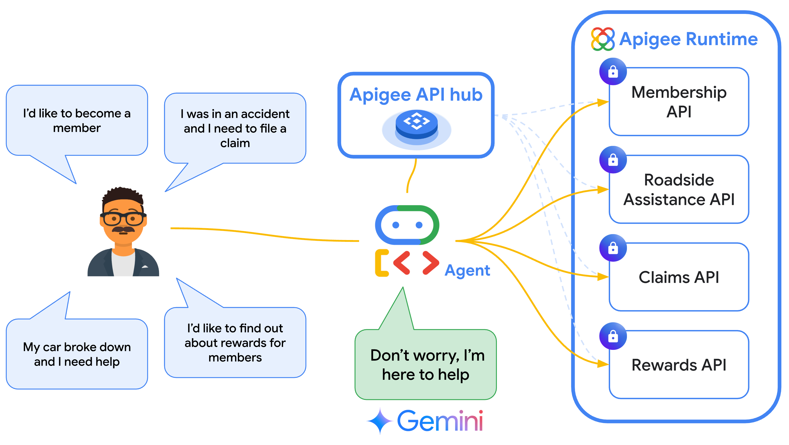

# Auto Insurance Agent APIs

This sample provides a set of APIs designed to act as tools for an [AI agent](https://cloud.google.com/discover/what-are-ai-agents) for auto insurance.

The agent implementation that accompanies this sample was built using Google's [Agent Development Kit (ADK)](https://google.github.io/adk-docs/). The agent code can be found in the main ADK sample repo [here](https://github.com/google/adk-samples/tree/main/python/agents/auto-insurance-agent).

This repo contains the following:

1. API specifications which act as the [tools](https://google.github.io/adk-docs/tools/) used by the agent.
    * These APIs are imported to [Apigee API hub](https://cloud.google.com/apigee/docs/apihub/what-is-api-hub) and then referenced in the agent code using ADK's built-in [ApiHubToolset](https://google.github.io/adk-docs/tools/google-cloud-tools/#apigee-api-hub-tools). This lets agent developers easily turn any existing API from their organization's API catalog into a tool with just a few lines of code.
2. An Apigee [Proxy](https://cloud.google.com/apigee/docs/api-platform/fundamentals/understanding-apis-and-api-proxies#whatisanapiproxy) implementation that serves the API responses to the agent.
    * This sample proxy implementation returns mock data generated using Gemini.



To try the sample, first follow the instructions below to deploy the API specs and proxies. Then clone the [agent implementation](https://github.com/google/adk-samples/tree/main/python/agents/auto-insurance-agent) and run it by following the instructions in that repo.


## Pre-Requisites

1. [Provision Apigee X](https://cloud.google.com/apigee/docs/api-platform/get-started/provisioning-intro)
2. [Provision Apigee API hub](https://cloud.google.com/apigee/docs/apihub/provision)
3. Configure [external access](https://cloud.google.com/apigee/docs/api-platform/get-started/configure-routing#external-access) for API traffic to your Apigee X instance
4. Enable Vertex AI in your project
5. Make sure the following tools are available in your terminal's $PATH (Cloud Shell has these preconfigured)
    - [gcloud SDK](https://cloud.google.com/sdk/docs/install)
    - [apigeecli](https://github.com/apigee/apigeecli)
    - unzip
    - curl
    - jq

## (QuickStart) Setup using CloudShell

Use the following GCP CloudShell tutorial, and follow the instructions.

[](https://ssh.cloud.google.com/cloudshell/open?cloudshell_git_repo=https://github.com/GoogleCloudPlatform/apigee-samples&cloudshell_git_branch=main&cloudshell_workspace=.&cloudshell_tutorial=adk-auto-insurance-agent/docs/cloudshell-tutorial.md)

## Setup environment

Ensure you have an active GCP account selected in the Cloud shell

```sh
gcloud auth login
```

Navigate to the 'adk-auto-insurance-agent' directory in the Cloud shell.

```sh
cd adk-auto-insurance-agent
```

Edit the provided sample `env.sh` file, and set the environment variables there.

Then, source the `env.sh` file in the Cloud shell.

```sh
source ./env.sh
```

## Deploy Apigee configurations

Next, let's deploy the sample to Apigee. Just run

```bash
./deploy-adk-auto-insurance-agent.sh
```

Export the `APIKEY` variable as mentioned in the command output

## Verification

You can test the sample with the following curl commands:

### To access Rewards API

#### List Rewards:

```sh
curl --location "https://$APIGEE_HOST/v1/samples/adk-cymbal-auto/rewards" \
--header "Content-Type: application/json" \
--header "x-apikey: $APIKEY"
```

### To access Claims API

#### Get Claim:

```sh
curl --location "https://$APIGEE_HOST/v1/samples/adk-cymbal-auto/claims/31432" \
--header "Content-Type: application/json" \
--header "x-apikey: $APIKEY"
```

#### List Claims:

```sh
curl --location "https://$APIGEE_HOST/v1/samples/adk-cymbal-auto/claims" \
--header "Content-Type: application/json" \
--header "x-apikey: $APIKEY"
```

#### Create Claim:

```sh
curl --location "https://$APIGEE_HOST/v1/samples/adk-cymbal-auto/claims" \
--header "Content-Type: application/json" \
--header "x-apikey: $APIKEY" \
--data '{"description": "Hail storm","location": "Mountain View, CA","memberId": "12345","reason": "HAIL_DAMAGE","vehicle": "Toyota Camry"}'
```

#### Delete Claim:

```sh
curl --location --request DELETE "https://$APIGEE_HOST/v1/samples/adk-cymbal-auto/claims/12345" \
--header "Content-Type: application/json" \
--header "x-apikey: $APIKEY"
```

### To access Members API

#### Get Member:

```sh
curl --location "https://$APIGEE_HOST/v1/samples/adk-cymbal-auto/members/31432" \
--header "Content-Type: application/json" \
--header "x-apikey: $APIKEY"
```

#### List Members:

```sh
curl --location "https://$APIGEE_HOST/v1/samples/adk-cymbal-auto/members" \
--header "Content-Type: application/json" \
--header "x-apikey: $APIKEY"
```

#### Create Member:

```sh
curl --location "https://$APIGEE_HOST/v1/samples/adk-cymbal-auto/members" \
--header "Content-Type: application/json" \
--header "x-apikey: $APIKEY" \
--data '{"firstName": "John","lastName": "Doe","email": "john.doe@example.com","phoneNumber": "555-123-4567","address": "123 Highland Dr","city": "Some Creek","state": "GA","zip": "30303"}'
```

#### Delete Member:

```sh
curl --location --request DELETE "https://$APIGEE_HOST/v1/samples/adk-cymbal-auto/members/12345" \
--header "Content-Type: application/json" \
--header "x-apikey: $APIKEY"
```

### To access Roadside Assistance API

#### Get Tow:

```sh
curl --location "https://$APIGEE_HOST/v1/samples/adk-cymbal-auto/tows/31432" \
--header "Content-Type: application/json" \
--header "x-apikey: $APIKEY"
```

#### List Tows:

```sh
curl --location "https://$APIGEE_HOST/v1/samples/adk-cymbal-auto/tows" \
--header "Content-Type: application/json" \
--header "x-apikey: $APIKEY"
```

#### Create Tow:

```sh
curl --location "https://$APIGEE_HOST/v1/samples/adk-cymbal-auto/tows" \
--header "Content-Type: application/json" \
--header "x-apikey: $APIKEY" \
--data '{"memberId": "12345","location": "Mountain View, CA"}'
```

#### Delete Tow:

```sh
curl --location --request DELETE "https://$APIGEE_HOST/v1/samples/adk-cymbal-auto/tows/45345" \
--header "Content-Type: application/json" \
--header "x-apikey: $APIKEY"
```

Once its deployed, you can follow the steps in the [README](https://github.com/google/adk-samples/tree/main/python/agents/auto-insurance-agent) to configure and run the agent.
