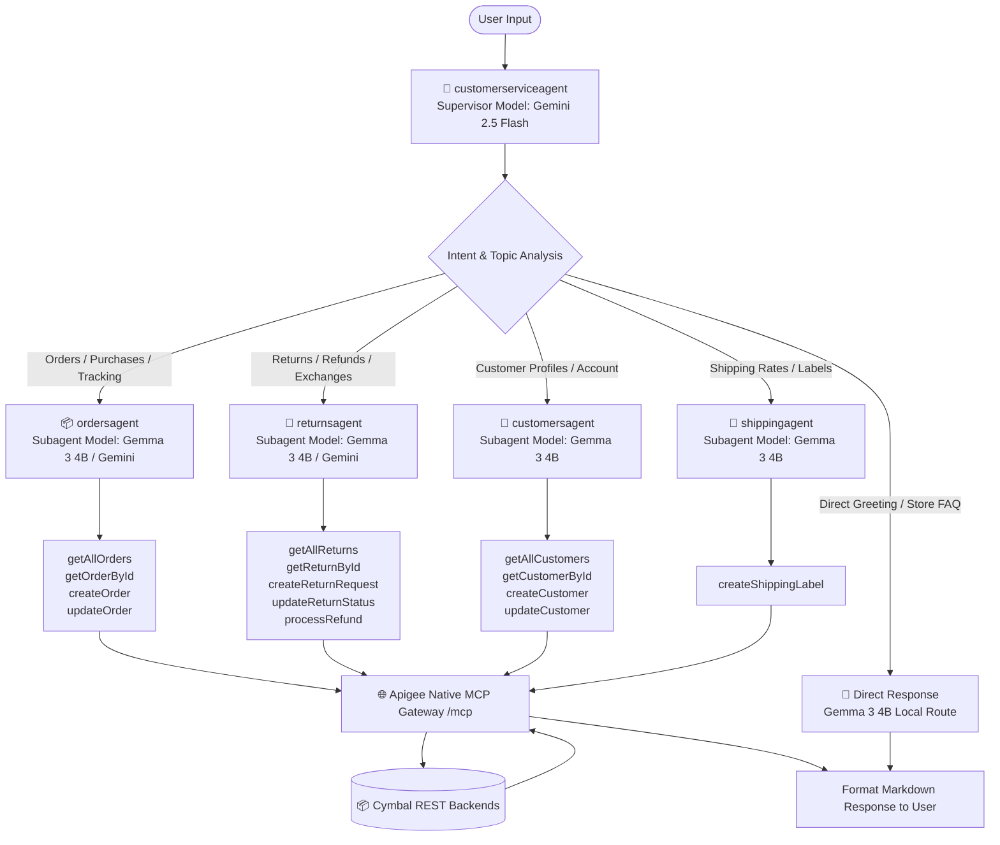

# Cymbal Retail: Agent Workflow & MCP Tool Reference (Jetski)

This document provides agent operational workflows, MCP tool definitions, handoff protocols, and LLM AI Gateway routing rules for autonomous agents in this codebase.

---

## 🤖 Agent Roles & Responsibilities

| Agent Name | Role / Function | Assigned MCP Tools | Delegation Keywords |
| :--- | :--- | :--- | :--- |
| **`customerserviceagent`** | Root Supervisor Agent | None directly (coordinates sub-agents via `transfer_to_agent` & `get_current_time`) | "help", "hello", initial customer inquiries |
| **`customersagent`** | Customer Profile Specialist | `getAllCustomers`, `getCustomerById`, `createCustomer`, `updateCustomer` | "customer", "profile", "account", "address" |
| **`ordersagent`** | Order Management Specialist | `getAllOrders`, `getOrderById`, `createOrder`, `updateOrder` | "order", "status", "purchase", "item" |
| **`returnsagent`** | Returns & Refunds Specialist | `getAllReturns`, `getReturnById`, `createReturnRequest`, `updateReturnStatus`, `processRefund` | "return", "refund", "exchange", "damaged" |
| **`shippingagent`** | Logistics & Shipping Specialist | `createShippingLabel` | "shipping", "rates", "delivery", "track", "label" |

---

## 🔀 Multi-Agent Delegation & Tool Routing Flow



---


## 📦 MCP JSON-RPC 2.0 Invocations

All tools are invoked via `POST https://{APIGEE_HOST}/mcp` with an active Bearer token.

### Standard Request Format
```json
{
  "jsonrpc": "2.0",
  "id": 1,
  "method": "tools/call",
  "params": {
    "name": "getOrderById",
    "arguments": {
      "orderId": "123456"
    }
  }
}
```

### Standard Response Format
```json
{
  "jsonrpc": "2.0",
  "id": 1,
  "result": {
    "content": [
      {
        "type": "text",
        "text": "{\"orderId\": \"123456\", \"status\": \"shipped\"}"
      }
    ],
    "isError": false
  }
}
```

---

## 🛡️ Governance & Security Protocols

1. **Model Armor Prompt Protection**:
   - Attacks, system prompt leaks, or jailbreak attempts are blocked by Apigee and return:
     `"Your prompt has been blocked"`.
2. **Cloud DLP PII Sanitization**:
   - PII fields such as Social Security Numbers, email addresses, and Credit Card numbers are automatically masked prior to reaching models or logs.
3. **OAuth 2.0 Scope Isolation**:
   - `manager` scope is strictly required for customer data access (`getAllCustomers`, `getCustomerById`, `createCustomer`).
   - `customer` scope is required for orders, returns, and shipping operations.
4. **Dynamic Hybrid Model Routing**:
   - Agent prompts can include `x-model-tier: local` to route routine mock tasks and simple FAQs to private **Gemma 3 (4B)** on Cloud Run.
   - Core supervisor reasoning and complex tool handoffs route to **Gemini 2.5 Flash** (`x-model-tier: frontier`).
5. **Apigee LLM AI Gateway (`llm-ai-gateway-v1`)**:
   - Provides unified `/chat/completions`, `/chat`, and native `/projects/.../generateContent` routes.
   - Transparently enforces per-model token quotas, prompt rate limiting, semantic caching, and response de-identification.
6. **Agent Identity & Registry Bindings**:
   - GEAP agents authenticate securely via Google Cloud Agent Identity Auth Providers (`cymbal-idp`) and Agent Registry bindings (`cymbal-auth-binding`) without static keys stored in container images.
