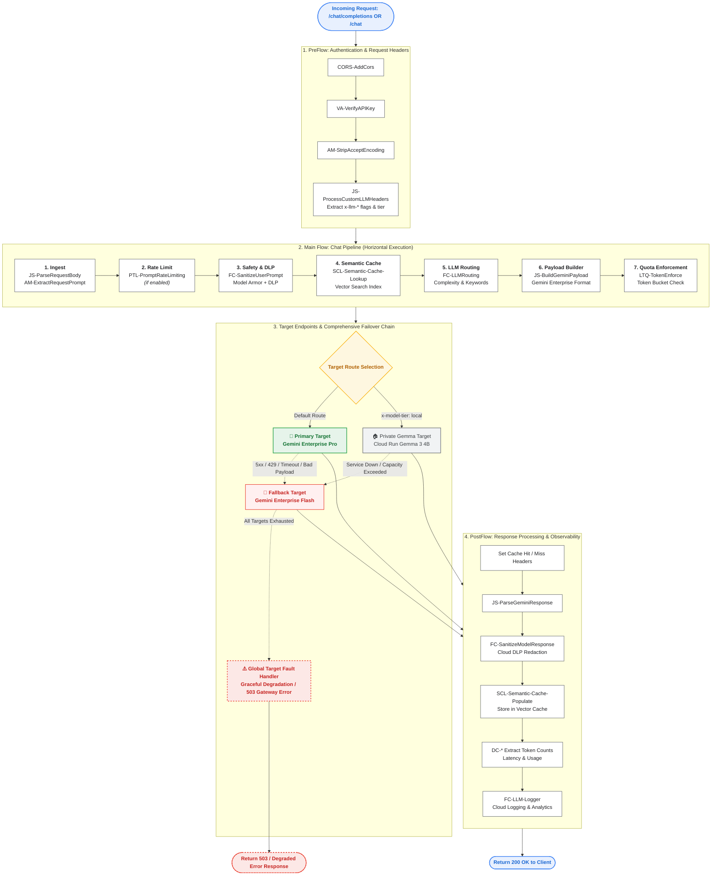

# Apigee X LLM AI Gateway Deployment & Analytics Guide

This document details the automated deployment and analytics visualization process for the **Apigee X LLM AI Gateway** (`llm-ai-gateway-v1`), along with its supporting shared flows, data collectors, security policies, and product configurations.

---

## 1. Overview, Features & Gateway Configuration

The **Apigee X LLM AI Gateway** (`llm-ai-gateway-v1`) acts as a centralized enterprise AI governance, routing, and protection layer for Generative AI workloads.

### Gateway Capabilities
The gateway provides the following core capabilities out of the box:
- **Token Rate Limiting (Prompt Rate Limiting)**: Prevents traffic spikes based on incoming token count volume.
- **Token Quota Enforcement**: Enforces token-based consumption limits configured at the API Product level.
- **LLM Observability**: Captures detailed GenAI telemetry across seven Apigee X Data Collectors.
- **Semantic Caching**: Avoids redundant LLM calls by looking up semantically similar requests via Vector Search embeddings.
- **Basic Jailbreaking Protection**: Filters malicious prompts and prompt injection attacks using Model Armor.
- **Routing to Different LLMs**: Supports dynamic routing between models (e.g., Gemini Pro vs. Flash).
- **Routing Based on Prompt Complexity**: Uses embeddings and Vector Search to route simple vs. complex prompts to the optimal model tier.
- **Locally Hosted Hybrid Routing (Gemma)**: Supports routing to local Gemma instances (*to be finalized*).
- **Model Failover**: Automatically switches to a fallback model if the primary model endpoint experiences downtime or faults.
- **Anonymization & Pseudonymization**: Sanitizes Sensitive Data Protection (DLP) patterns in user prompts and model responses.

### Policy Execution Pipeline & Flow Architecture

The diagram below details the exact policy execution chain across `PreFlow`, `Flow: chat`, `TargetEndpoint`, and `PostFlow` in `llm-ai-gateway-v1`:



---


### Control Headers (Processing Flags)
Each treatment or feature can be enabled or disabled per request using HTTP headers. By default, all features are enabled (`true`). Passing any value other than `true` (e.g., `false`) disables the respective treatment:

| Header Name | Default | Description |
| :--- | :---: | :--- |
| `x-llm-cache` | `true` | Enables Semantic Caching lookup and population |
| `x-llm-sanitize-user-prompt` | `true` | Enables user prompt cleaning/anonymization via DLP & Model Armor |
| `x-llm-routing` | `true` | Enables dynamic model routing based on prompt complexity |
| `x-llm-token-quota-enforce` | `true` | Enforces API Product LLM token consumption quotas |
| `x-llm-sanitize-model-response` | `true` | Enables model response cleaning/anonymization via DLP |
| `x-llm-prompt-rate-limiting` | `true` | Enables token-based load spike detection and prompt rate limiting |

### Model Resolution & Priority Routing Hierarchy
The gateway determines the target LLM model and routing tier during `JS-ParseRequestBody` execution according to the following strict order of precedence:

#### 1. Gemma / Local Execution Priority Route (`route_to_gemma = true`)
Gemma routing takes precedence over Cloud/Vertex AI models if requested explicitly:
- **Header Tier Override**: `x-model-tier` set to `local` or `gemma`.
- **Header Model Name**: `x-llm-model` or `x-model-name` containing `"gemma"` (case-insensitive).
- **Body / URI Model**: Model path or JSON field containing `"gemma"`.

*Result*: Sets `route_to_gemma = "true"` and assigns `model` to the requested Gemma variant (defaults to `gemma-3-4b`).

#### 2. Cloud / Vertex AI Model Resolution Hierarchy (`route_to_gemma = false`)
When Gemma is not explicitly targeted, the gateway resolves the Vertex AI target model as follows:
1. **Consolidated HTTP Header**: Value specified in `x-llm-model` (primary header) or `x-model-name` (secondary header alias).
2. **URI Path / Request Payload**: Model extracted from the request URI path (e.g. `/publishers/google/models/{model}`) or JSON body `model` field.
3. **Default Property**: Fallback to `default_model` configured in `vertex_config.properties` (e.g. `gemini-2.5-pro` or `gemini-2.5-flash`).

#### 3. Dynamic Semantic Routing (`FC-LLMRouting`)
If dynamic routing is enabled (`x-llm-routing: true`) and the model has not been explicitly overridden by a header or URI, the gateway invokes the `FC-LLMRouting` Flow Callout policy. This delegates execution to the **`llm-routing-v2`** Shared Flow to classify prompt complexity and assign the optimal model tier.

##### Execution Steps of `llm-routing-v2`:
1. **Execution Condition**:
   - Executes only when `llm_routing_enabled != "false"` and `llm_model == llm_default_model`.
2. **Step 1: Keyword Route Pre-Check (`KVM-GetKeywordRoute`)**:
   - Executes `JS-PrepareKVMKey` to normalize the prompt and queries an Apigee Key-Value Map (`KVM-GetKeywordRoute`).
   - If an exact keyword match is found (e.g. mapping simple intent keywords directly to `"simple"`), vector embedding calls are bypassed to minimize latency and API cost.
3. **Step 2: Text Embedding Generation (`SCO-GetEmbeddings`)**:
   - If no KVM match occurred, a Service Callout (`SCO-GetEmbeddings`) sends the `request_prompt` to the Vertex AI Embeddings API (`text-embedding-005`).
   - `JS-ExtractEmbeddingVector` parses the response and extracts the 768-dimensional dense vector representation of the prompt.
4. **Step 3: Vector Search Nearest Neighbor Query (`SCO-VectorSearch`)**:
   - A Service Callout (`SCO-VectorSearch`) queries the configured Vertex AI Vector Search Index Endpoint (`routing_index_endpoint_id`).
   - Finds the nearest neighbor datapoint cluster (`simple` vs `complex` query reference embeddings) and returns the similarity distance score.
5. **Step 4: Model Decision & Variable Assignment (`JS-DetermineModelRoute`)**:
   - Evaluates the nearest neighbor `datapointId` prefix and sets the model tier:
     - **`gemma_*` (Retail FAQ Intents)**: Sets `model = llm_fallback_model` and `route_to_gemma = "true"` (routes to private Gemma 3 instance).
     - **`simple_*` (Greetings & General Tasks)**: Sets `model = llm_fallback_model` (`gemini-2.5-flash`).
     - **`complex_*` (Complex Reasoning & Code)**: Maintains `model = default_model` (`gemini-2.5-pro`).
   - Populates observability variables: `semantic_match_id` (datapoint ID) and `semantic_match_distance` (cosine distance score).

##### Vector Search Intent Generation & Upsert Script (`upsert_routing_embeddings.py`)
To populate or update the Vertex AI Vector Search Index with reference intent embeddings, run the automated provisioning script [`upsert_routing_embeddings.py`](upsert_routing_embeddings.py):

```bash
# Execute embedding generation and upsert to Vertex AI Vector Search
./upsert_routing_embeddings.py --project $PROJECT_ID --region $REGION --index-id $ROUTING_INDEX_ID
```

**How Vector Search Intent Generation Works**:
1. **Dataset Intent Categorization**: Defines structured prompt datasets categorized into `simple_*` (general tasks), `gemma_*` (retail FAQs like store hours, shipping, return policy), and `complex_*` (coding, architecture analysis).
2. **Text Embedding Generation**: Sends each intent text prompt to Vertex AI `text-embedding-005:predict` endpoint to extract a 768-dimensional floating point feature vector.
3. **Index Upsert**: Formats feature vectors into Vertex AI datapoint JSON payloads (`datapointId` + `featureVector`) and calls `gcloud ai indexes upsert-datapoints` to publish them to the Vector Search index.

### Mandatory Configuration: `vertex_config.properties`
Before deploying, you **must configure** the following property values in `vertex_config.properties` within both the **`llm-routing-v2` shared flow** and the **`llm-ai-gateway-v1` API proxy** (`apiproxy/resources/properties/vertex_config.properties`):

```properties
# Common
region=<your-gcp-region>
project=<your-project-id>
project_number=<your-project-number>
index_endpoint_dns=<retrieve-from-vector-search-dns>
default_model=gemini-2.5-pro
default_fallback_model=gemini-2.5-flash

# Routing (Dynamic routing based on prompt complexity)
routing_index_endpoint_id=<retrieve-from-vector-search-endpoint-id>
routing_deployed_index_id=semantic_routing_index_endpoint_deployment_v2
routing_index_id=<retrieve-from-vector-search-index-id>

# Cache (Semantic Caching via Vector Search)
cache_index_endpoint_id=<retrieve-from-vector-search-endpoint-id>
cache_deployed_index_id=semantic_cache_index_endpoint_deployment
cache_index_id=<retrieve-from-vector-search-index-id>
```

---

## 2. Automated Deployment Script (`deploy-llm-ai-gateway.sh`)

The deployment script [`deploy-llm-ai-gateway.sh`](deploy-llm-ai-gateway.sh) automates the provisioning of the gateway on Apigee X. It orchestrates:

1. **Service Account Provisioning (`apigee-vertex-ai-caller`)**:
   - Provisions the dedicated runtime Service Account (`apigee-vertex-ai-caller@${PROJECT_ID}.iam.gserviceaccount.com`).
   - Assigns minimal least-privilege IAM roles:
     - **`roles/run.invoker` (Cloud Run Invoker)**: **Mandatory** for `llm-ai-gateway-v1` and `llm-routing-v2` to authenticate and invoke private Gemma 3 microservices deployed on Cloud Run.
     - **`roles/aiplatform.user` (Vertex AI User)**: Required to call Vertex AI Gemini prediction models and Vector Search embedding endpoints.
     - **`roles/dlp.user` & `roles/dlp.reader`**: Required for Cloud DLP real-time PII de-identification.
     - **`roles/modelarmor.user` & `roles/modelarmor.viewer`**: Required for Model Armor responsible AI template execution.
   - Binds Google Cloud Apigee Service Agent (`service-${PROJECT_NUMBER}@gcp-sa-apigee.iam.gserviceaccount.com`) token creation and user permissions (`roles/iam.serviceAccountUser`, `roles/iam.serviceAccountTokenCreator`) so Apigee can impersonate this account at runtime.
2. **Apigee X Data Collectors**:
   - Creates seven structured data collectors for LLM observability and reporting:
     - `dc_candidates_token_count_v2` (`INTEGER`)
     - `dc_cost_center_v2` (`STRING`)
     - `dc_model_v2` (`STRING`)
     - `dc_prompt_token_count_v2` (`INTEGER`)
     - `dc_response_type_v2` (`STRING`)
     - `dc_time_to_first_token_v2` (`INTEGER`)
     - `dc_total_token_count_v2` (`INTEGER`)
3. **KeyValueMap (`model-armor-config-v2`)**:
   - Provisions an environment-scoped KVM `model-armor-config-v2` containing the `modelArmorTemplate` key configured via the `$MODEL_ARMOR_TEMPLATE` environment variable.
4. **Shared Flows Deployment**:
   - `llm-modelarmor-dlp-v1`: Enforces Model Armor responsible AI governance and Sensitive Data Protection (DLP) de-identification.
   - `llm-routing-v2`: Routes requests dynamically and handles model failovers.
5. **API Proxy Deployment (`llm-ai-gateway-v1`)**:
   - Deploys the GenAI proxy bundle with token count extraction, semantic caching, routing, and quota enforcement policies.
6. **Developer & Developer App Configuration**:
   - Provisions developer `cymbal-retail-dev@example.com` (`cymbal-retail-dev`).
   - Provisions the API Product `llm-ai-gateway-product` with both proxy operations and per-model **LLM Token Quotas** on `llm-ai-gateway-v1`:
     - **gemini-2.5-pro**: `POST` operations limited to **10,000 tokens every 5 minutes**.
     - **gemini-2.5-flash**: `POST` operations limited to **100,000 tokens every 5 minutes**.
7. **Application Provisioning (`llm-ai-gateway-app`)**:
   - Connects the developer and API product to issue an API consumer key.

---

## 3. Prerequisites

Before running the deployment script, ensure you have authenticated with Google Cloud CLI and set the mandatory environment variables:

```bash
# Authenticate with Google Cloud
gcloud auth login
gcloud auth application-default login

# Export your target Google Cloud Project ID, Apigee Environment, and Model Armor Template
export PROJECT_ID="your-gcp-project-id"
export APIGEE_ENV="your-apigee-environment"
export MODEL_ARMOR_TEMPLATE="projects/your-gcp-project-id/locations/your-region/templates/your-model-armor-template"

# Optional: Set a custom access token (otherwise automatically fetched)
# export TOKEN=$(gcloud auth application-default print-access-token)
```

Ensure the script is executable:

```bash
chmod +x ./deploy-llm-ai-gateway.sh
```

---

## 4. Executing the Deployment Script

Run the deployment script from the root repository directory:

```bash
./deploy-llm-ai-gateway.sh
```

### Expected Output
- The script checks or creates the `apigee-vertex-ai-caller` service account and applies IAM policy bindings.
- It verifies and creates all seven LLM `dc_*_v2` Data Collectors.
- It creates or updates the `model-armor-config-v2` KVM with the `modelArmorTemplate` entry.
- It deploys the `llm-modelarmor-dlp-v1` and `llm-routing-v2` shared flows.
- It deploys the `llm-ai-gateway-v1` proxy.
- It configures the API Product `llm-ai-gateway-product` via Apigee REST API v1.
- It creates the `llm-ai-gateway-app` developer application and prints out the generated **API Key (`consumerKey`)** at the console summary.

---

## 5. Visualizing LLM AI Gateway Analytics

Once requests are flowing through your deployed LLM AI Gateway, you can inspect real-time metrics and telemetry using the local Go analytics dashboard provided in `./llm-ai-gateway-analytics`.

### Step-by-Step Visualization

1. Navigate to the analytics directory:
   ```bash
   cd ./llm-ai-gateway-analytics
   ```

2. Export your Apigee environment variable (and project ID if not already exported):
   ```bash
   export APIGEE_ENVIRONMENT="your-apigee-environment"
   export GOOGLE_CLOUD_PROJECT="$PROJECT_ID"
   ```

3. Run the Go web server:
   ```bash
   go run .
   ```

4. **Open the Web UI**:
   - **In Cloud Shell**: Click on the **Web Preview** icon (top right of the terminal console) and select **Preview on port 8080**.
   - **Locally**: Open your web browser and navigate to:
     ```
     http://localhost:8080
     ```

---

## 6. Testing the Gateway

Once your API proxy is deployed, you can test both OpenAI-compatible completions and native Vertex AI Gemini endpoints. Set the required variables first:

```bash
export APIGEE_HOSTNAME="your-apigee-hostname"
export API_KEY="your-consumer-key"
export PROJECT_ID="your-gcp-project-id"
export REGION="your-vertexai-region" # e.g., europe-west1
```

### Option A: OpenAI-Compatible Chat Completions Endpoint

```bash
curl -H "x-apikey: $API_KEY" -H "Content-Type: application/json; charset=utf-8" -d '{"model": "gemini-2.5-pro", "stream": false, "messages": [{"role": "user", "content": "when is the next eclispe in france?"}]}' https://$APIGEE_HOSTNAME/v1/llm-ai-gateway/chat/completions -vk
```

### Option B: Vertex AI Gemini generateContent Endpoint

```bash
curl -s -X POST "https://$APIGEE_HOSTNAME/v1/llm-ai-gateway/projects/$PROJECT_ID/locations/$REGION/publishers/google/models/gemini-2.5-pro:generateContent" \
  -H "x-apikey: $API_KEY" \
  -H "Content-Type: application/json; charset=utf-8" \
  -d '{"contents": [{"role": "USER", "parts": [{"text": "What does the Orion constellation look like?"}]}]}' -vk | jq
```

---

## 7. Automated BDD Regression Testing

The repository includes a dedicated Cucumber BDD regression test suite covering all LLM AI Gateway features and security behaviors in [`test/integration/features/llm-ai-gateway.feature`](test/integration/features/llm-ai-gateway.feature):

* **Unauthorized Requests (401)**: Missing and invalid API key rejection via `VA-VerifyAPIKey`.
* **OpenAI-Compatible Payload**: `POST /v1/llm-ai-gateway/chat/completions` validation.
* **Native Chat Payload**: `POST /v1/llm-ai-gateway/chat` validation.
* **Dynamic Hybrid Model Routing**: `x-model-tier: frontier` and `x-llm-routing: false`.
* **Model Overrides**: `x-llm-model: gemini-2.5-pro` explicit header override.
* **Prompt Rate Limiting & Token Quotas**: `x-llm-prompt-rate-limiting` and `x-llm-token-quota-enforce`.
* **Responsible AI & PII Sanitization**: `x-llm-sanitize-user-prompt` and `x-llm-sanitize-model-response`.
* **Native Vertex AI Endpoint**: `POST /v1/llm-ai-gateway/projects/{PROJECT_ID}/locations/us-central1/publishers/google/models/gemini-2.5-flash:generateContent`.
* **Invalid Route Handling (404)**: Unknown route error response.

To execute the LLM AI Gateway regression tests as part of the unified test suite:
```bash
./run_integration_tests.sh
```


