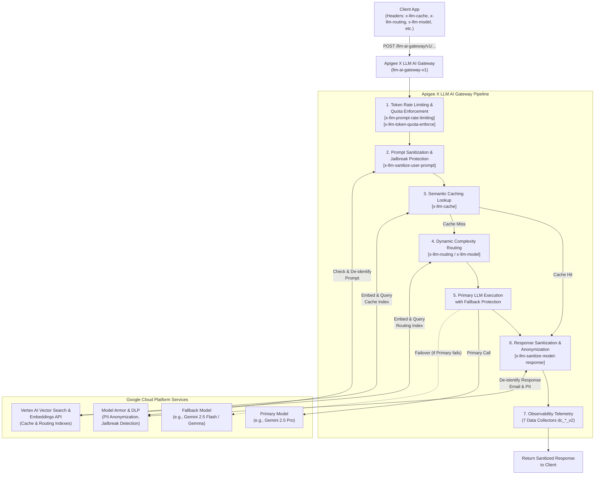

# Apigee X LLM AI Gateway Deployment & Analytics Guide

This document details the automated deployment and analytics visualization process for the **Apigee X LLM AI Gateway** (`llm-ai-gateway-v1`), along with its supporting shared flows, data collectors, security policies, and product configurations.

---

## 1. Overview, Features & Gateway Configuration

The **Apigee X LLM AI Gateway** (`llm-ai-gateway-v1`) acts as a centralized enterprise AI governance, routing, and protection layer for Generative AI workloads.

### Gateway Capabilities
The gateway provides the following core capabilities out of the box:
- **Token Rate Limiting (Prompt Rate Limiting)**: Prevents traffic spikes based on incoming token count volume.
- **Token Quota Enforcement**: Enforces token-based consumption limits configured at the API Product level.
- **LLM Observability**: Captures detailed GenAI telemetry across seven Apigee X Data Collectors.
- **Semantic Caching**: Avoids redundant LLM calls by looking up semantically similar requests via Vector Search embeddings.
- **Basic Jailbreaking Protection**: Filters malicious prompts and prompt injection attacks using Model Armor.
- **Routing to Different LLMs**: Supports dynamic routing between models (e.g., Gemini Pro vs. Flash).
- **Routing Based on Prompt Complexity**: Uses embeddings and Vector Search to route simple vs. complex prompts to the optimal model tier.
- **Locally Hosted Hybrid Routing (Gemma)**: Supports routing to local Gemma instances (*to be finalized*).
- **Model Failover**: Automatically switches to a fallback model if the primary model endpoint experiences downtime or faults.
- **Anonymization & Pseudonymization**: Sanitizes Sensitive Data Protection (DLP) patterns in user prompts and model responses.

### Architecture & Request Lifecycle Diagram

The diagram below illustrates how the **Apigee X LLM AI Gateway** (`/llm-ai-gateway/v1`) interacts with Google Cloud services (**Vector Search & Embeddings**, **Model Armor & DLP**, and **Vertex AI Gemini Models** with automatic failover) while allowing request-level override via HTTP `x-llm-*` headers:



### Control Headers (Processing Flags)
Each treatment or feature can be enabled or disabled per request using HTTP headers. By default, all features are enabled (`true`). Passing any value other than `true` (e.g., `false`) disables the respective treatment:

| Header Name | Default | Description |
| :--- | :---: | :--- |
| `x-llm-cache` | `true` | Enables Semantic Caching lookup and population |
| `x-llm-sanitize-user-prompt` | `true` | Enables user prompt cleaning/anonymization via DLP & Model Armor |
| `x-llm-routing` | `true` | Enables dynamic model routing based on prompt complexity |
| `x-llm-token-quota-enforce` | `true` | Enforces API Product LLM token consumption quotas |
| `x-llm-sanitize-model-response` | `true` | Enables model response cleaning/anonymization via DLP |
| `x-llm-prompt-rate-limiting` | `true` | Enables token-based load spike detection and prompt rate limiting |

### Model Resolution & Override Rules (`x-llm-model`)
You can explicitly override the target LLM model by passing the `x-llm-model` HTTP header. The gateway determines the target model according to the following strict order of precedence:
1. **HTTP Header**: Value specified in `x-llm-model`.
2. **URI Path**: Model extracted from the request URI path.
3. **Request Payload**: Model specified within the JSON body payload.
4. **Default Property**: Fallback to `default_model` configured in `vertex_config.properties`.

### Mandatory Configuration: `vertex_config.properties`
Before deploying, you **must configure** the following property values in `vertex_config.properties` within both the **`llm-routing-v2` shared flow** and the **`llm-ai-gateway-v1` API proxy** (`apiproxy/resources/properties/vertex_config.properties`):

```properties
# Common
region=<your-gcp-region>
project=<your-project-id>
project_number=<your-project-number>
index_endpoint_dns=<retrieve-from-vector-search-dns>
default_model=gemini-2.5-pro
default_fallback_model=gemini-2.5-flash

# Routing (Dynamic routing based on prompt complexity)
routing_index_endpoint_id=<retrieve-from-vector-search-endpoint-id>
routing_deployed_index_id=semantic_routing_index_endpoint_deployment_v2
routing_index_id=<retrieve-from-vector-search-index-id>

# Cache (Semantic Caching via Vector Search)
cache_index_endpoint_id=<retrieve-from-vector-search-endpoint-id>
cache_deployed_index_id=semantic_cache_index_endpoint_deployment
cache_index_id=<retrieve-from-vector-search-index-id>
```

---

## 2. Automated Deployment Script (`deploy-llm-ai-gateway.sh`)

The deployment script [`deploy-llm-ai-gateway.sh`](file:///usr/local/google/home/joelgauci/repo/apigee-samples/adk-cymbal-retail-agent/deploy-llm-ai-gateway.sh) automates the provisioning of the gateway on Apigee X. It orchestrates:

1. **Service Account Provisioning (`apigee-vertex-ai-caller`)**:
   - Assigns minimal least-privilege IAM roles (`roles/run.invoker`, `roles/aiplatform.user`, `roles/dlp.user`, `roles/dlp.reader`, `roles/modelarmor.user`, `roles/modelarmor.viewer`).
   - Binds Google Cloud Apigee Service Agent token creation/user permissions so Apigee can impersonate this account during runtime LLM calls and deployment.
2. **Apigee X Data Collectors**:
   - Creates seven structured data collectors for LLM observability and reporting:
     - `dc_candidates_token_count_v2` (`INTEGER`)
     - `dc_cost_center_v2` (`STRING`)
     - `dc_model_v2` (`STRING`)
     - `dc_prompt_token_count_v2` (`INTEGER`)
     - `dc_response_type_v2` (`STRING`)
     - `dc_time_to_first_token_v2` (`INTEGER`)
     - `dc_total_token_count_v2` (`INTEGER`)
3. **Shared Flows Deployment**:
   - `llm-modelarmor-dlp-v1`: Enforces Model Armor responsible AI governance and Sensitive Data Protection (DLP) de-identification.
   - `llm-routing-v2`: Routes requests dynamically and handles model failovers.
4. **API Proxy Deployment (`llm-ai-gateway-v1`)**:
   - Deploys the GenAI proxy bundle with token count extraction, semantic caching, routing, and quota enforcement policies.
5. **Developer & Developer App Configuration**:
   - Provisions developer `cymbal-retail-dev@example.com` (`cymbal-retail-dev`).
   - Provisions the API Product `llm-ai-gateway-product` with both standard proxy operations and per-model **LLM Token Quotas**:
     - **gemini-2.5-pro**: `POST` operations limited to **10,000 tokens every 5 minutes**.
     - **gemini-2.5-flash**: `POST` operations limited to **100,000 tokens every 5 minutes**.
6. **Application Provisioning (`llm-ai-gateway-app`)**:
   - Connects the developer and API product to issue an API consumer key.

---

## 2. Prerequisites

Before running the deployment script, ensure you have authenticated with Google Cloud CLI and set the mandatory environment variables:

```bash
# Authenticate with Google Cloud
gcloud auth login
gcloud auth application-default login

# Export your target Google Cloud Project ID and Apigee Environment
export PROJECT_ID="your-gcp-project-id"
export APIGEE_ENV="your-apigee-environment"

# Optional: Set a custom access token (otherwise automatically fetched)
# export TOKEN=$(gcloud auth application-default print-access-token)
```

Ensure the script is executable:

```bash
chmod +x ./deploy-llm-ai-gateway.sh
```

---

## 3. Executing the Deployment Script

Run the deployment script from the root repository directory:

```bash
./deploy-llm-ai-gateway.sh
```

### Expected Output
- The script checks or creates the `apigee-vertex-ai-caller` service account and applies IAM policy bindings.
- It verifies and creates all seven LLM `dc_*_v2` Data Collectors.
- It deploys the `llm-modelarmor-dlp-v1` and `llm-routing-v2` shared flows.
- It deploys the `llm-ai-gateway-v1` proxy.
- It configures the API Product `llm-ai-gateway-product` via Apigee REST API v1.
- It creates the `llm-ai-gateway-app` developer application and prints out the generated **API Key (`consumerKey`)** at the console summary.

---

## 4. Visualizing LLM AI Gateway Analytics

Once requests are flowing through your deployed LLM AI Gateway, you can inspect real-time metrics and telemetry using the local Go analytics dashboard provided in `./llm-ai-gateway-analytics`.

### Step-by-Step Visualization

1. Navigate to the analytics directory:
   ```bash
   cd ./llm-ai-gateway-analytics
   ```

2. Export your Apigee environment variable (and project ID if not already exported):
   ```bash
   export APIGEE_ENVIRONMENT="your-apigee-environment"
   export GOOGLE_CLOUD_PROJECT="$PROJECT_ID"
   ```

3. Run the Go web server:
   ```bash
   go run .
   ```

4. **Open the Web UI**:
   - **In Cloud Shell**: Click on the **Web Preview** icon (top right of the terminal console) and select **Preview on port 8080**.
   - **Locally**: Open your web browser and navigate to:
     ```
     http://localhost:8080
     ```

---

## 5. Testing the Gateway

Once your API proxy is deployed, you can test both OpenAI-compatible completions and native Vertex AI Gemini endpoints. Set the required variables first:

```bash
export APIGEE_HOSTNAME="your-apigee-hostname"
export API_KEY="your-consumer-key"
export PROJECT_ID="your-gcp-project-id"
export REGION="your-vertexai-region" # e.g., europe-west1
```

### Option A: OpenAI-Compatible Chat Completions Endpoint

```bash
curl -H "x-apikey: $API_KEY" -H "Content-Type: application/json; charset=utf-8" -d '{"model": "gemini-2.5-pro", "stream": false, "messages": [{"role": "user", "content": "when is the next eclispe in france?"}]}' https://$APIGEE_HOSTNAME/llm-ai-gateway/v1/chat/completions -vk
```

### Option B: Vertex AI Gemini generateContent Endpoint

```bash
curl -s -X POST "https://$APIGEE_HOSTNAME/llm-ai-gateway/v1/projects/$PROJECT_ID/locations/$REGION/publishers/google/models/gemini-2.5-pro:generateContent" \
  -H "x-apikey: $API_KEY" \
  -H "Content-Type: application/json; charset=utf-8" \
  -d '{"contents": [{"role": "USER", "parts": [{"text": "What does the Orion constellation look like?"}]}]}' -vk | jq
```

