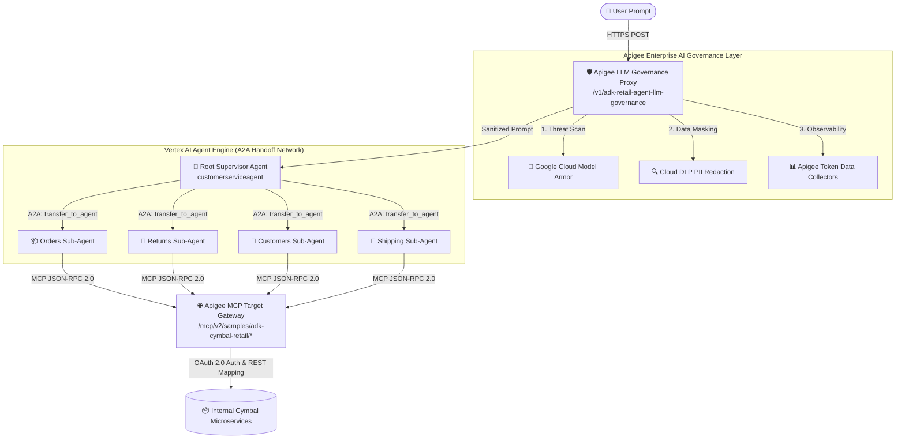

# Cymbal Retail: ADK & Apigee Enterprise AI Governance Showcase

[](https://cloud.google.com)
[](https://cloud.google.com/vertex-ai)
[](https://cloud.google.com/apigee)
[](https://modelcontextprotocol.io)

An enterprise demonstration reference project showcasing **Agent-to-Agent (A2A)** autonomous orchestration built with Google's **Agent Development Kit (ADK)** and **Vertex AI Agent Engine**, integrated with standardized **Model Context Protocol (MCP)** tool gateways, and fully governed by **Apigee API Management** (featuring **Google Cloud Model Armor** threat defense and **Cloud DLP** real-time PII sanitization).

---

## 🏛️ System Architecture



---

## ✨ Key Enterprise Capabilities

### 1. Autonomous Agent-to-Agent (A2A) Orchestration
Instead of forcing a single LLM prompt to navigate complex enterprise APIs, the architecture implements a **Supervisor / Worker network**:
* **`customerserviceagent` (Supervisor):** Clarifies customer intent and delegates execution context cleanly to domain workers.
* **Specialized Sub-Agents:** `ordersagent`, `returnsagent`, `customersagent`, and `shippingagent` operate with isolated system instructions and restricted tool permissions.

### 2. Unified MCP Tool Architecture
All backend microservices are resolved via Apigee as a standardized **Model Context Protocol (MCP)** server layout. Agents negotiate tool lists and tool calls using JSON-RPC 2.0 over HTTP, secured using dynamic OAuth 2.0 Bearer access tokens generated at runtime.

### 3. Apigee Enterprise AI Governance
Every LLM generation request is proxied through Apigee (`adk-retail-agent-llm-governance-v1`), enforcing:
* **Pre-Generation Threat Filtering (Model Armor):** Intercepts Prompt Injections, Jailbreaks, Hate Speech, and Malicious URIs before they reach Vertex AI.
* **On-the-Fly PII Redaction (Cloud DLP):** Executes transformation templates to mask Social Security Numbers, Credit Cards, and sensitive entries with `#`.
* **Token Cost Attribution & RAI Analytics:** XML Data Collectors record exact prompt, candidate, and thought token counts, compiling custom enterprise visual reports directly in Apigee Analytics.

---

## 🛠️ Architectural Upgrades & Recent Changes

### 1. OAuth 2.0 Access Token Protection
- **OAuth 2.0 Token Verification:** Upgraded all domain REST API proxies (`cymbal-customers-v2`, `cymbal-returns-v2`, and `cymbal-shipping-v2`) from API Key validation (`VA-VerifyKey`) to OAuth 2.0 Access Token verification (`OA-VerifyAccessToken`), enforcing standard scopes like `customer` and `manager`.
- **Mock Identity Provider (`oauth-server`):** Deployed a dedicated mock OIDC provider proxy to support programmatic authorization code flow and access token issuance for tests and agents.

### 2. Streamlined Gateway & Configuration Cleanups
- **Removed Legacy Config Mappings:** Completely cleaned up and deleted the legacy python KVM deployer (`deploy_mcp_configs.py`) and the corresponding Apigee KVM store (`MCP-Configs`), migrating all backend routing configurations directly to the native gateway.
- **Indentation & Formatting Polish:** Standardized all deployment attributes, teams metadata, and API product JSON structures (`cymbal-retail-product-ops.json`) with clean, consistent 2-space indentation formatting.

### 4. Runtime Stability & 100% BDD Verification
- **Python 3.13 Runtime:** Recompiled local ADK virtual environments (`.venv`) using Python 3.13 to prevent AnyIO task group cancellation scope exceptions during live Server-Sent Events (`adk web` streaming).
- **Automated Verification:** Verified that 100% of all 37 BDD integration scenarios and 275 steps pass cleanly against the live Apigee Gateway.

---

## 📁 Repository Layout

```text
├── config/                  # Backend microservice OpenAPI specs & target YAMLs
├── proxies/                 # Apigee API Management proxy deployment bundles
│   ├── adk-retail-agent-llm-governance-v1/   # AI safety & token logging proxy
│   ├── cymbal-customers-v2/                  # Domain backend REST proxy (Customers)
│   ├── cymbal-orders-v2/                     # Domain backend REST proxy (Orders)
│   ├── cymbal-returns-v2/                    # Domain backend REST proxy (Returns)
│   ├── cymbal-shipping-v2/                   # Domain backend REST proxy (Shipping)
│   └── oauth-server/                         # Mock OAuth 2.0 Authorization Server
├── python/agents/           # ADK Python agent definitions & toolsets
│   ├── cymbal-retail-agent/                  # Standard retail agent
│   ├── cymbal-retail-agent-apigeellm/        # Governed Model Armor agent
│   └── cymbal-retail-agent-geap/             # GEAP Agent Runtime deployment agent
├── sharedflowbundles/       # Reusable Apigee flows (LLM extraction & cloud logging)
├── test/integration/        # Apickli BDD Cucumber automated integration suites
├── deploy-adk-cymbal-retail-agent.sh     # Automated full GCP/Apigee deployer
└── run_integration_tests.sh                  # Automated BDD verification runner
```

---

## 🚀 Getting Started & Local Testing

### Prerequisites
* Google Cloud CLI (`gcloud`) authenticated with Project Admin permissions.
* Python `>=3.12` with `virtualenv` / `poetry`.
* Node.js `>=18` (for BDD test execution).

### 1. Environment Configuration
Ensure your local agent environment file is configured with your active Google Cloud and Apigee hostname settings:
```bash
cd python/agents/cymbal-retail-agent-apigeellm
cat <<EOF > .env
GOOGLE_CLOUD_PROJECT="your-gcp-project-id"
GOOGLE_CLOUD_LOCATION="us-central1"
APIGEE_HOSTNAME="your-org-endpoint.nip.io"
GOOGLE_GENAI_USE_VERTEXAI="TRUE"
MODEL_NAME="gemini-2.5-flash"
APIGEE_LLM="/v1/adk-retail-agent-llm-governance"
EOF
```

### 2. Run Local ADK Web UI
To interact with your agent network via video/audio/chat development server:
```bash
cd python/agents/cymbal-retail-agent-apigeellm
# Activate the virtual environment where ADK is installed:
source ../../../../workspace/cymbal-retail-agent/.venv/bin/activate
adk web --reload_agents cymbal_retail_agent_apigeellm
```

### 3. Run Automated BDD Integration Suites
To execute live Apickli Cucumber validation against the Apigee Gateway proxies:
```bash
./run_integration_tests.sh
```

---

## ☁️ Production Deployment

To provision and deploy the entire enterprise infrastructure from scratch (including GCP Artifact Registry, Secret Manager, Cloud Run, BigQuery, Apigee API Hub registration, Data Collectors, and Vertex AI Reasoning Engine provisioning):

```bash
export PROJECT_ID="your-gcp-project-id"
export APIGEE_ENV="qa"
export APIGEE_HOST="your-apigee-host.nip.io"

./deploy-adk-cymbal-retail-agent.sh
```

---

## 📄 License
Copyright 2026 Google LLC. Licensed under the [Apache License, Version 2.0](LICENSE.txt).
