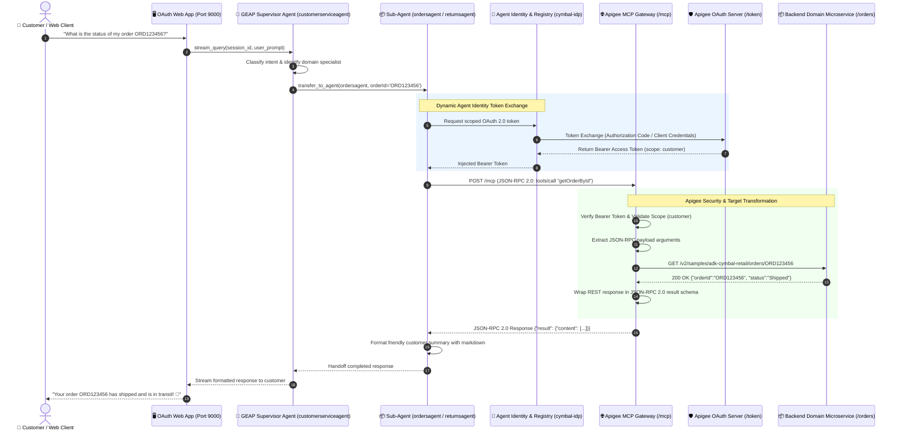
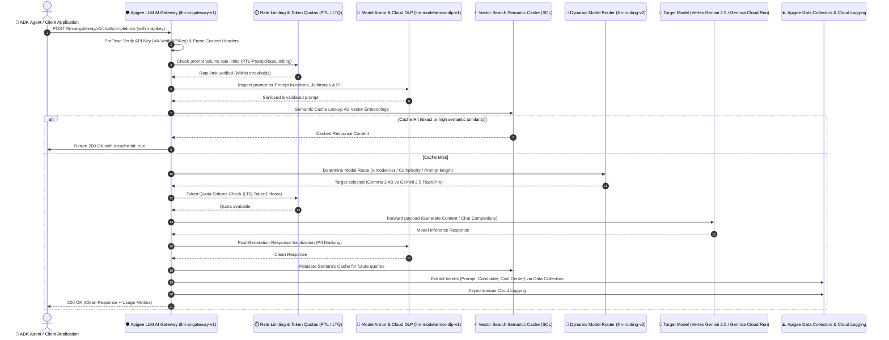
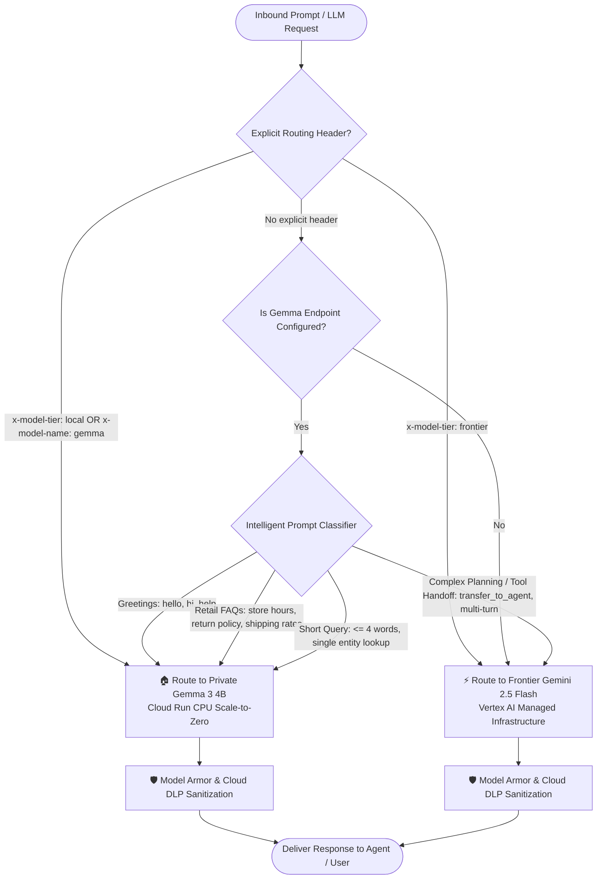

# Cymbal Retail: ADK & Apigee Enterprise AI Governance Showcase

[](https://cloud.google.com)
[](https://cloud.google.com/vertex-ai)
[](https://cloud.google.com/apigee)
[](https://modelcontextprotocol.io)

An enterprise reference architecture showcasing **Agent-to-Agent (A2A)** autonomous orchestration built with Google's **Agent Development Kit (ADK)** and deployed on **Gemini Enterprise Agent Platform (GEAP) Agent Runtime (Reasoning Engine)**, integrated with standardized **Model Context Protocol (MCP)** tool gateways, secured via **Google Cloud Agent Identity**, and fully governed by **Apigee API Management** (featuring **Google Cloud Model Armor** threat defense, **Sensitive Data Protection (DLP)** real-time PII sanitization, and **Apigee LLM AI Gateway** token rate limiting, quotas, and semantic caching).

---

## 🏛️ System Architecture

```mermaid
graph TD
    User([👤 User / Client App / Web UI]) -->|HTTPS POST| ClientApp[🖥️ OAuth Client / ADK Web Playground]
    
    subgraph "Google Cloud Agent Platform (GEAP Agent Runtime)"
        Supervisor[👔 Root Supervisor Agent<br>customerserviceagent (Gemini 2.5 Flash)]
        Supervisor -->|A2A: transfer_to_agent| Orders[📦 Orders Sub-Agent]
        Supervisor -->|A2A: transfer_to_agent| Returns[🔄 Returns Sub-Agent]
        Supervisor -->|A2A: transfer_to_agent| Customers[👤 Customers Sub-Agent]
        Supervisor -->|A2A: transfer_to_agent| Shipping[🚚 Shipping Sub-Agent]
        
        AgentId[🔑 Google Cloud Agent Identity<br>cymbal-idp / cymbal-auth-binding] -.->|Dynamic OAuth Token| Supervisor
    end

    ClientApp -->|Query Stream| Supervisor
    
    subgraph "Apigee LLM AI Gateway (/llm-ai-gateway/v1)"
        LLMGateway[🤖 Apigee LLM AI Gateway<br>/chat/completions & /chat]
        LLMGateway --> RateQuota[1. Prompt Rate Limiting & Token Quotas]
        RateQuota --> ModelArmorDLP[2. Model Armor Defense & DLP Redaction]
        ModelArmorDLP --> SemCache[3. Semantic Caching via Vector Search]
        SemCache --> ModelRouter[4. Dynamic Model Routing & Fallback]
        ModelRouter --> VertexAI[⚡ Vertex AI Gemini Models]
        ModelRouter --> GemmaCloudRun[🏠 Private Gemma 3 4B on Cloud Run]
    end

    subgraph "Apigee Enterprise MCP & API Governance Layer"
        MCPGate[🌐 Apigee Native MCP Gateway<br>/mcp]
        OAuthServer[🛡️ OAuth 2.0 Auth Server<br>/authorize & /token]
        
        Orders -->|MCP JSON-RPC 2.0| MCPGate
        Returns -->|MCP JSON-RPC 2.0| MCPGate
        Customers -->|MCP JSON-RPC 2.0| MCPGate
        Shipping -->|MCP JSON-RPC 2.0| MCPGate
        
        MCPGate -->|OAuth 2.0 Bearer Auth| Services[(📦 Cymbal REST Microservices<br>/v2/samples/adk-cymbal-retail/*)]
    end
```

---

## 🔄 End-to-End Architectural Flows

### 1. Multi-Agent A2A Delegation & Native MCP Tool Execution Flow



---

### 2. Apigee LLM AI Gateway Request Lifecycle & Governance Pipeline



---

### 3. Dynamic Hybrid AI Routing Decision Tree



---


## ✨ Key Enterprise Capabilities

### 1. Autonomous Multi-Agent Orchestration (A2A)
Instead of forcing a single LLM prompt to navigate complex enterprise APIs, the architecture implements a **Supervisor / Worker network**:
* **`customerserviceagent` (Supervisor):** Clarifies customer intent, inspects session state, and delegates execution context cleanly to domain workers via `transfer_to_agent`.
* **Specialized Sub-Agents:** `ordersagent`, `returnsagent`, `customersagent`, and `shippingagent` operate with isolated system instructions, specialized domain prompts, and scoped tool permissions.

### 2. Deployed GEAP Agent Runtime (Vertex AI Reasoning Engine)
* **Managed Execution:** The agent runs natively on Google Cloud's Agent Platform as a managed `ReasoningEngine` resource (`projects/{PROJECT_NUMBER}/locations/{REGION}/reasoningEngines/{ENGINE_ID}`).
* **Stateful Sessions:** Backed by persistent session lifecycle management (`create_session`, `list_sessions`, `delete_session`) preserving multi-turn context across agent handoffs.
* **Agent Identity & Registry Bindings:** Eliminates static API keys and client secrets from container source code by utilizing Google Cloud Agent Identity Auth Providers (`cymbal-idp`) and Agent Registry bindings (`cymbal-auth-binding`).

### 3. Centralized Apigee LLM AI Gateway (`llm-ai-gateway-v1`)
The dedicated LLM AI Gateway proxy provides enterprise control, security, and optimization for all GenAI workloads:
* **Multi-Format Protocols:** Supports OpenAI-compatible (`POST /llm-ai-gateway/v1/chat/completions`), native (`POST /llm-ai-gateway/v1/chat`), and direct Vertex AI `generateContent` schemas.
* **Token Rate Limiting & Quotas:** Automatically enforces token volume rate limits (`x-llm-prompt-rate-limiting`) and per-model consumption quotas (`x-llm-token-quota-enforce`).
* **Semantic Caching:** Integrates with Vertex AI Vector Search embeddings to cache identical and semantically similar queries (`x-llm-cache`), slashing latency and model invocation costs.
* **Model Overrides & Routing:** Allows runtime selection via `x-llm-model` or `x-model-tier` headers with automatic fallback protection.

### 4. Unified Apigee Native MCP Gateway (`/mcp`)
All backend microservices are exposed via Apigee as a standardized **Model Context Protocol (MCP)** server layout at `/mcp`. Agents negotiate tool discovery (`tools/list`), session initialization (`initialize`), and execution (`tools/call`) using JSON-RPC 2.0 over HTTP:
* **Customers (4 tools):** `getAllCustomers`, `getCustomerById`, `createCustomer`, `updateCustomer` (Requires `manager` scope).
* **Orders (4 tools):** `getAllOrders`, `getOrderById`, `createOrder`, `updateOrder` (Requires `customer` scope).
* **Returns (5 tools):** `getAllReturns`, `getReturnById`, `createReturnRequest`, `updateReturnStatus`, `processRefund` (Requires `customer` scope).
* **Shipping (1 tool):** `createShippingLabel` (Requires `customer` scope).

### 5. Dynamic Hybrid AI Routing & Private Gemma 3 (4B)
To eliminate Vertex AI 429 quota exhaustion and optimize inference costs:
* **Intelligent Prompt Classifier:** Evaluates prompt complexity and header directives (`x-model-tier: local` or `x-model-tier: frontier`).
* **Private Local Routing:** Routes simple greetings, FAQs, and mock microservice calls to a self-contained **Gemma 3 (4B)** instance running on **Cloud Run (CPU with Scale-to-Zero)**.
* **Frontier Routing:** Routes multi-agent planning and complex reasoning tasks to **Gemini 2.5 Flash**.

### 6. Responsible AI Governance (Model Armor & Cloud DLP)
Every LLM generation request is proxied through Apigee, enforcing uniform security:
* **Pre-Generation Threat Filtering (Model Armor):** Intercepts Prompt Injections, Jailbreaks, Hate Speech, and Malicious URIs before reaching models.
* **On-the-Fly PII Redaction (Cloud DLP):** Executes transformation templates to mask Social Security Numbers, Credit Cards, and sensitive entries.
* **Token Cost Attribution & RAI Analytics:** Data Collectors record exact prompt, candidate, and thought token counts, compiling custom enterprise visual reports directly in Apigee Analytics.

### 7. OAuth 2.0 RFC-Compliant Token Protection & Scope Authorization
* **OAuth 2.0 Token Verification (`OA-VerifyAccessToken`):** All domain REST API proxies (`cymbal-customers-v2`, `cymbal-orders-v2`, `cymbal-returns-v2`, `cymbal-shipping-v2`, and `/mcp`) enforce OAuth 2.0 Bearer access tokens with fine-grained scopes (`customer`, `manager`).
* **Tool Filtering via Payload Authorization:** The MCP gateway (`cymbal-discovery-v1`) validates and filters available tools based on the MCP payload operations permitted by the caller's active token.
* **OAuth 2.0 Authorization Server (`oauth-server`):** Built-in RFC-compliant authorization server supporting Authorization Code grant flow, OpenID discovery (`/.well-known/openid-configuration`), and Protected Resource Metadata (`/.well-known/oauth-protected-resource/mcp`).

---

## 📁 Repository Layout

```text
├── config/                                    # Backend microservice OpenAPI specs & target YAMLs
├── llm-ai-gateway-analytics/                  # Go web analytics dashboard for LLM Gateway metrics
├── oauth_client/                              # Web chat client app for testing the live agent on Agent Runtime
├── proxies/                                   # Apigee API Management proxy deployment bundles
│   ├── adk-retail-agent-llm-governance-v1/     # AI safety, hybrid routing & token logging proxy
│   ├── cymbal-customers-v2/                    # Domain backend REST proxy (Customers)
│   ├── cymbal-orders-v2/                       # Domain backend REST proxy (Orders)
│   ├── cymbal-returns-v2/                      # Domain backend REST proxy (Returns)
│   ├── cymbal-shipping-v2/                     # Domain backend REST proxy (Shipping)
│   ├── cymbal-discovery-v1/                    # Native Apigee MCP Gateway (/mcp)
│   ├── llm-ai-gateway-v1/                      # Enterprise LLM AI Gateway proxy (OpenAI & native)
│   └── oauth-server/                           # OAuth 2.0 Authorization Server
├── python/agents/                             # ADK Python agent definitions & toolsets
│   ├── cymbal-retail-agent/                    # Standard retail agent (Local ADK dev)
│   ├── cymbal-retail-agent-apigeellm/          # Governed agent w/Apigee LLM gateway (Local ADK dev)
│   ├── cymbal-retail-agent-geap/               # Agent Platform (GEAP) Reasoning Engine deployment
│   └── cymbal-retail-agent-governance/         # AI Governance agent configuration
├── sharedflowbundles/                         # Reusable Apigee shared flows
│   ├── cloud-logger-v1/                        # Cloud Logging integration
│   ├── llm-extract-candidates-v1/              # Token and candidate metadata extraction
│   ├── llm-extract-prompts-v1/                 # Prompt extraction and normalization
│   ├── llm-logger-v1/                          # LLM transaction logging
│   ├── llm-modelarmor-dlp-v1/                  # Model Armor & Cloud DLP sanitization
│   └── llm-routing-v2/                         # Dynamic complexity routing & failover
├── test/integration/                          # Apickli BDD Cucumber automated regression suites
│   └── features/
│       ├── customers-api.feature               # REST Customers endpoints & lifecycle
│       ├── orders-api.feature                  # REST Orders endpoints & lifecycle
│       ├── returns-api.feature                 # REST Returns endpoints & process-refund
│       ├── shipping-api.feature                # REST Shipping endpoints & label rates
│       ├── llm-ai-gateway.feature              # LLM AI Gateway routes, quotas, caching (10 scenarios)
│       ├── llm-governance.feature              # AI Safety, hybrid routing, DLP, token quotas
│       ├── mcp-customers-api.feature           # MCP JSON-RPC Customers tools
│       ├── mcp-orders-api.feature              # MCP JSON-RPC Orders tools
│       ├── mcp-returns-api.feature             # MCP JSON-RPC Returns tools
│       ├── mcp-shipping-api.feature            # MCP JSON-RPC Shipping tools
│       ├── mcp-multicloud-governance.feature   # MCP Discovery & Payload Auth
│       └── oauth-server.feature                # OAuth 2.0 RFC compliance & error flows
├── deploy-llm-ai-gateway.sh                   # Automated LLM AI Gateway provisioning script
├── deploy-adk-cymbal-retail-agent.sh           # Main Apigee & microservice deployment script
├── setup-qwiklabs-gemma.sh                    # Turnkey Qwiklabs workshop setup script (Cloud Run CPU Gemma 3 4B)
├── deploy-gemma-cpu-cloudrun.sh               # CPU-Optimized Gemma 3 (4B) Cloud Run deployment
├── deploy-gemma-cloudrun.sh                   # GPU-Optimized Gemma 2 (9B) Cloud Run deployment (vLLM)
├── redeploy-all-proxies.sh                    # Clean Apigee proxy redeployment script
├── test-agent-runtime-e2e.py                  # GEAP Agent Runtime Reasoning Engine regression suite
├── test-mcp-e2e.py                            # Python End-to-End MCP & Security regression test suite
├── test-hybrid-routing.py                     # Python Hybrid AI Routing (Gemma vs Gemini) verification script
├── perf-test-gemma.py                         # Python Performance & Concurrency Load Benchmark (4 tiers)
├── setup.sh                                   # Master setup entrypoint
└── run_integration_tests.sh                    # Unified Multi-Suite Regression Test Orchestrator
```

---

## 🚀 Getting Started & Setup

### Prerequisites
* Google Cloud CLI (`gcloud`) authenticated with Project Admin permissions.
* Python `>=3.12` with `uv` or `poetry`.
* Node.js `>=18` (for BDD test execution).

### 1. Full Production Deployment & GCP Provisioning
To provision and deploy the entire enterprise infrastructure from scratch, set the values in `env.sh`, then run:

```bash
source env.sh 
./setup.sh
```

Upon successful deployment, the script outputs all deployed endpoints, API keys, and credentials needed for verification.

### 2. Standalone LLM AI Gateway Deployment
To deploy or update the Apigee LLM AI Gateway and its supporting shared flows, data collectors, and products:

```bash
source env.sh
./deploy-llm-ai-gateway.sh
```

### 3. Deploying Agent Platform (GEAP) Reasoning Engine
To package and deploy the agent to Google Cloud Agent Platform:

```bash
source env.sh
cd python/agents/cymbal-retail-agent-geap
python deployment/deploy.py
```

### 4. Turnkey Gemma 3 (4B) Workshop Setup (Qwiklabs / Workshops)
To deploy **Gemma 3 (4B)** on Cloud Run CPU (**4 vCPUs, 8GB RAM, Scale-to-Zero**) without requiring GPU quotas, and test hybrid routing in a single command:

```bash
./setup-qwiklabs-gemma.sh
```

---

## 🧪 Comprehensive Testing & Verification Suite

The repository includes a unified, multi-tiered regression test architecture:

### 1. Unified Test Runner (`./run_integration_tests.sh`)
Executes all 4 regression suites sequentially with automated credential discovery from `env.sh` and `apigeecli`:

```bash
./run_integration_tests.sh
```

**Output Summary:**
```text
=================================================================
                    REGRESSION SUITE SUMMARY                    
=================================================================
  [1] Cucumber BDD Suite:            PASSED (OAuth & Security Flow Verified)
  [2] Native MCP Gateway E2E:        PASSED (17/17 Tools & Edge Cases)
  [3] Agent Runtime Reasoning Engine: PASSED (5/5 Lifecycle & Tools)
  [4] Hybrid Model Routing:          PASSED (Threat Defense & Guardrails)
=================================================================
🎉 REGRESSION SUITE RUN COMPLETE!
```

---

### 2. Detailed Breakdown of Individual Test Suites

#### A. Cucumber BDD Regression Suite (`npm test`)
Executes **67 scenarios (441 steps)** across 12 feature files:
* **LLM AI Gateway (`llm-ai-gateway.feature`):** 10 scenarios testing OpenAI `/chat/completions`, native `/chat`, token rate limiting, quotas, semantic caching, and model overrides (**100% Pass Rate**).
* **LLM Governance (`llm-governance.feature`):** AI Safety, hybrid routing, Model Armor, and DLP.
* **Native MCP Tools (`mcp-*.feature`):** JSON-RPC tool calls for all domain services.
* **OAuth 2.0 Server (`oauth-server.feature`):** Authorization code grants, token exchange, and RFC error conditions.
* **Domain REST Proxies (`*-api.feature`):** CRUD operations and scope enforcement across Customers, Orders, Returns, and Shipping.

#### B. Native MCP Gateway End-to-End Suite (`test-mcp-e2e.py`)
Validates MCP session negotiation, tool discovery, and execution across all 14 tools and security edges:
```bash
python3 test-mcp-e2e.py
```
* **Coverage:** `getAllCustomers`, `getCustomerById`, `createCustomer`, `updateCustomer`, `getAllOrders`, `getOrderById`, `createOrder`, `updateOrder`, `getAllReturns`, `getReturnById`, `createReturnRequest`, `updateReturnStatus`, `processRefund`, `createShippingLabel`.
* **Security & Negative Checks:** Rejection of unknown tools (`401`), unauthenticated executions (`401`), and malformed JSON-RPC methods (`400`).

#### C. GEAP Agent Runtime Reasoning Engine Suite (`test-agent-runtime-e2e.py`)
Validates the live deployed Agent Engine instance on Vertex AI Agent Platform:
```bash
python/agents/cymbal-retail-agent-geap/.venv/bin/python3 test-agent-runtime-e2e.py
```
* **Coverage:** Remote engine discovery, session create/list/delete lifecycle, streaming query with tool invocation (`get_current_time`), assistant persona instructions, and Agent Identity provider configuration (`cymbal-idp`).

#### D. Hybrid Model Routing & AI Safety Suite (`test-hybrid-routing.py`)
Verifies intelligent routing and responsible AI controls:
```bash
python3 test-hybrid-routing.py
```
* **Coverage:** Local Gemma routing (`x-model-tier: local`), Frontier Gemini routing (`x-model-tier: frontier`), Model Armor threat blocking, and Cloud DLP real-time PII redaction.

#### E. Performance & Concurrency Load Benchmark (`perf-test-gemma.py`)
Runs automated multi-user load testing across 4 concurrency tiers:
```bash
python3 perf-test-gemma.py
```

---

## 💻 Testing Interactive Client Apps

### 1. Testing Agents Locally with ADK Web UI
```bash
cd python/agents/cymbal-retail-agent # or cd python/agents/cymbal-retail-agent-apigeellm
uv sync
uv run adk web --reload_agents
```

### 2. Testing Live Remote Agent on GEAP via OAuth Web App
```bash
source env.sh
cd oauth_client
uv run python app.py
```
1. Open `http://localhost:9000`.
2. Ask an inquiry requiring authorization (e.g. *"List my recent orders"*).
3. Authenticate via the OAuth 2.0 consent card.
4. Verify seamless follow-up tool execution and multi-turn state preservation.

---

## ⚡ Performance Benchmarks & Sizing Architecture

### Recommended Deployment Model: **Model A (Standard Qwiklabs Sandbox)**
In customer workshops and Qwiklabs training formats, the recommended architecture is **Model A: 1 Student per Dedicated GCP Sandbox Project**:
* **Infrastructure:** Each attendee runs their own isolated Cloud Run CPU instance (**4 vCPUs, 8GB RAM, Scale-to-Zero**) via `./setup-qwiklabs-gemma.sh`.
* **Zero GPU Quota:** Operates completely on standard CPU quotas without requiring scarce A100/L4 GPU allocations.
* **$0 Idle Cost:** Scale-to-Zero (`--min-instances=0`) automatically terminates compute resources when students are inactive.
* **Private Zero-Trust Target Security:** Apigee securely authenticates with Cloud Run using Google Cloud OIDC tokens (`<Authentication><GoogleIDToken>`).

### Empirical Concurrency & Stress Test Matrix

| Concurrency Tier | Scope / Load Type | Total Requests | Success Rate | p50 Latency | Throughput | Primary Behavior / Root Cause |
| :--- | :---: | :---: | :---: | :---: | :---: | :--- |
| **1 User (Model A: Qwiklabs)** | **Individual Student** | 3 | **100.0%** | **7.25s** | 5.68 tok/s | ✅ **Optimal for student workshops** |
| **5 Users (Shared Container)** | Moderate Concurrency | 10 | **10.0%** | **21.16s** | 2.39 tok/s | ⚠️ CPU contention & client timeout |
| **15 Users (Shared Container)**| Peak Multi-tenant | 15 | **0.0%** | >30.0s | 0.00 tok/s | ❌ Single CPU container queue saturation |
| **Frontier Gemini 2.5 Flash** | Multi-Agent Reasoning | 10 | **100.0%** | **1.99s** | **141.52 tok/s**| ✅ Massively parallel TPU compute |

---

## 📄 License
Copyright 2026 Google LLC. Licensed under the [Apache License, Version 2.0](LICENSE.txt).
