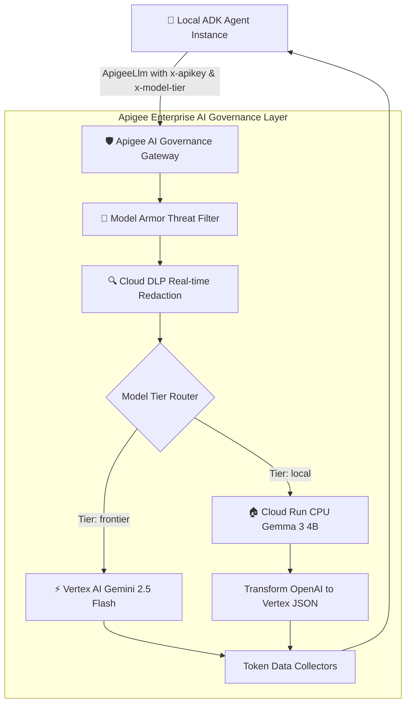

# Cymbal Retail Agent with Governance

An autonomous retail customer service agent built with Google's **Agent Development Kit (ADK)** and powered by **Gemini Enterprise Agent Platform**. This agent coordinates specialized domain sub-agents (`ordersagent`, `customersagent`, `returnsagent`, and `shippingagent`) to handle customer inquiries via a standardized **Model Context Protocol (MCP)** toolset routed through Apigee. 

This agent also routes model calls through Apigee AI Gateway to enforce pre-generation threat filtering using **Google Cloud Model Armor**, real-time PII sanitization via **Cloud DLP**, and token cost attribution via **Apigee API Management**.

---

## 🏛️ Governance Architecture

Before the root agent processes user prompts or delegates to domain sub-agents, requests are routed through an Apigee AI gateway proxy (`/v1/llm-ai-gateway`) which performs the following:
- **Model Armor Threat Filtering:** Intercepts prompt injections, jailbreaks, and hate speech.
- **Cloud DLP Redaction:** Masks sensitive PII (SSNs, credit card numbers, email addresses) on the fly.
- **Token Analytics:** Captures prompt and candidate token counts for RAI dashboards.
- **Dynamic Tier Routing:** Routes to local private Gemma 3 (4B) on Cloud Run when `DEFAULT_MODEL_TIER="local"` or to Gemini 2.5 Flash.



---


## 🚀 Local Setup & Development

### 1. Environment Configuration
Ensure your local `.env` file is populated with your Google Cloud and Apigee configuration:
```ini
GOOGLE_CLOUD_PROJECT="<PROJECT_ID>"
GOOGLE_CLOUD_LOCATION="us-central1"
APIGEE_HOSTNAME="<APIGEE_HOSTNAME>"
GOOGLE_GENAI_USE_VERTEXAI="TRUE"
GOOGLE_CLOUD_STORAGE_BUCKET="<PROJECT_ID>_cymbal_retail_agent"
MODEL_NAME="gemini-2.5-flash"
AGENT_SERVICE_ACCOUNT="llm-cymbal-retail-agent@<PROJECT_ID>.iam.gserviceaccount.com"
APIGEE_LLM="/v1/llm-ai-gateway"

```

### 2. Virtual Environment Synchronization
We recommend using **Python 3.13** for interactive local runtime execution:
```bash
uv sync --python 3.13
```

### 3. Running ADK Web UI Locally
To launch the interactive web playground UI:
```bash
source .env
uv run adk web --reload_agents . --port 8000
```
Open your web browser and navigate to **http://127.0.0.1:8000**.
