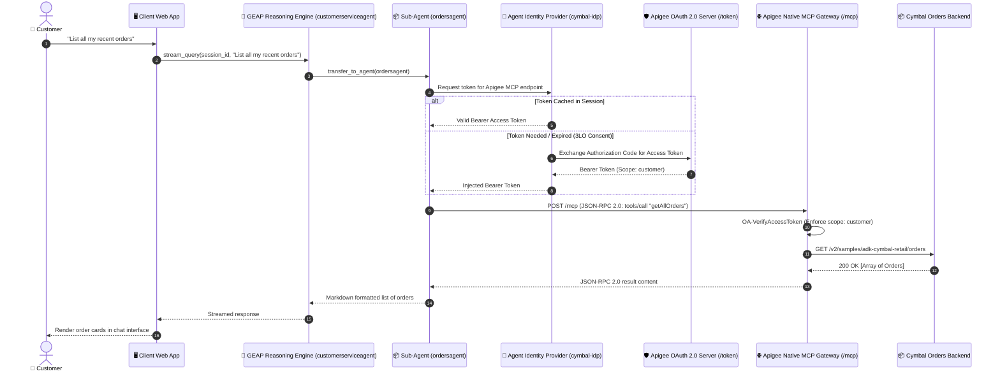

# Cymbal Retail Agent (GEAP)

An autonomous retail customer service agent built with Google's **Agent Development Kit (ADK)** and deployed on the **Gemini Enterprise Agent Platform (GEAP) Agent Runtime (Reasoning Engine)**. This agent coordinates specialized domain sub-agents (`ordersagent`, `customersagent`, `returnsagent`, and `shippingagent`) using a standardized **Model Context Protocol (MCP)** toolset resolved through **Agent Registry** and secured via **Agent Identity**.

---

## 🏛️ Architecture & Platform Integration

* **Gemini Enterprise Agent Platform (GEAP) Agent Runtime:** Deployed as a managed Vertex AI Reasoning Engine instance (`projects/{PROJECT_NUMBER}/locations/{REGION}/reasoningEngines/{ENGINE_ID}`).
* **Agent Registry:** Dynamically resolves native MCP tool registrations and proxy endpoints without hardcoding URLs.
* **Agent Identity Auth Provider:** Integrates with [Google Cloud Agent Identity](https://docs.cloud.google.com/iam/docs/auth-manager-overview) (`gcloud beta agent-identity auth-providers`) to obtain and refresh OAuth 2.0 access tokens dynamically via client ID bindings (`cymbal-idp` and `cymbal-auth-binding`).
* **Multi-Turn Stateful Sessions:** Backed by Agent Engine session storage with complete conversational context preservation and delegation tracking.

### Agent Identity & MCP Execution Sequence



---


## 🚀 Deployment & Management

### 1. Deploying to Agent Platform
To deploy the agent reasoning engine to Vertex AI / Agent Platform and bind the Agent Identity Auth Provider:

```bash
# Ensure environment variables are loaded
source ../../../env.sh

# Run the deployment orchestrator
python deployment/deploy.py
```

The deployment script executes:
1. **Agent Gateway Pre-flight Check:** Inspects Network Services Agent Gateways.
2. **Reasoning Engine Packaging & Deployment:** Uploads artifacts to `$STAGING_BUCKET` and creates the `ReasoningEngine` instance in Vertex AI.
3. **Agent Identity Provider Registration:** Provisions `projects/{PROJECT_ID}/locations/{REGION}/authProviders/cymbal-idp` with the OAuth Client ID.
4. **Agent Registry Binding:** Links the Auth Provider to the Apigee MCP endpoint (`cymbal-auth-binding`).

### 2. Undeploying & Cleaning Up
To remove the deployed reasoning engine and its associated Agent Identity resources:

```bash
python deployment/undeploy.py
```

---

## 🧪 Automated Regression Testing

The repository includes a comprehensive Python end-to-end regression test suite in [`test-agent-runtime-e2e.py`](../../../test-agent-runtime-e2e.py) to verify the live deployed agent:

```bash
# Run the Agent Runtime regression suite
python3 ../../../test-agent-runtime-e2e.py
```

### Test Coverage (5/5 Automated Suites)
1. **Reasoning Engine Discovery:** Validates remote `ReasoningEngine` resource availability via `client.agent_engines.get()`.
2. **Session Lifecycle:** Tests `create_session()`, `list_sessions()`, and `delete_session()`.
3. **Tool Invocation:** Tests live streaming query with tool calling execution (`get_current_time`).
4. **Assistant Persona & Delegation:** Verifies the Cymbal Retail customer assistant instructions and `transfer_to_agent` handoff schema.
5. **Agent Identity Provider Validation:** Queries `gcloud beta agent-identity auth-providers` to ensure proper client ID bindings.

---

## 💻 Local Setup & Development

### 1. Environment Configuration
Populate `.env` with your Google Cloud and Apigee configuration:
```ini
GOOGLE_CLOUD_PROJECT="apigeex-talanki"
GOOGLE_CLOUD_LOCATION="us-central1"
APIGEE_HOSTNAME="136.68.214.207.nip.io"
GOOGLE_GENAI_USE_VERTEXAI="TRUE"
GOOGLE_CLOUD_STORAGE_BUCKET="apigeex-talanki_cymbal_retail_agent"
MODEL_NAME="gemini-2.5-flash"
AGENT_SERVICE_ACCOUNT="llm-cymbal-retail-agent@apigeex-talanki.iam.gserviceaccount.com"
APIGEE_LLM="/v1/adk-retail-agent-llm-governance"
```

### 2. Virtual Environment Synchronization
```bash
uv sync --python 3.13
```

### 3. Running ADK Web UI Locally
```bash
source .env
uv run adk web --reload_agents . --port 8000
```
Open your browser at **http://127.0.0.1:8000**.
