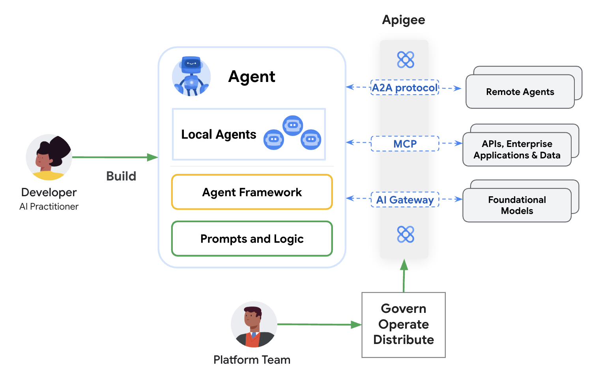
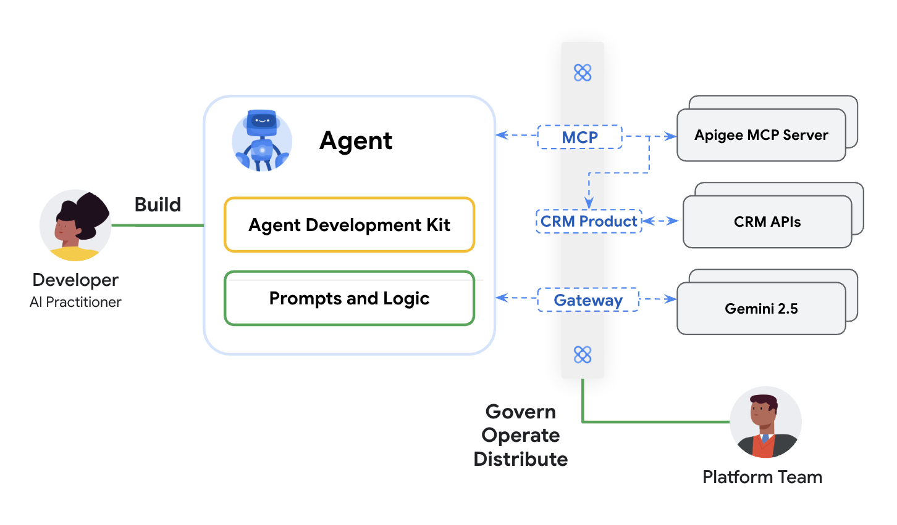

# Apigee Model Context Protocol (MCP) Server Implementation

As agents and Large Language Models (LLMs) become more sophisticated, their ability to interact with external systems and APIs becomes crucial for performing meaningful actions. The Model Context Protocol (MCP) provides a standardized way for these AI models to discover and invoke tools, which are essentially capabilities exposed by external services.

This sample demonstrates how Apigee, Google Cloud's API management platform, can serve as a powerful enabler for MCP. It provides an MCP server implementation that dynamically discovers your existing Apigee-managed API Products and their underlying OpenAPI specifications. These are then exposed as MCP tools, allowing AI agents (e.g., those built with Google's Agent Development Kit - ADK) to seamlessly and securely interact with your enterprise APIs.

## Why Apigee for MCP and AI Workloads?

Integrating Apigee with MCP offers significant advantages for AI-driven applications:

1.  **Leverage Existing API Investments**: Expose your battle-tested, Apigee-managed APIs to AI agents without requiring extensive redevelopment. Apigee acts as the bridge, translating your existing API landscape into a format AI agents can understand and use.
2.  **Standardized Discovery and Invocation**: MCP provides the "lingua franca" for AI agents to interact with tools. By using Apigee to serve these tools, you ensure consistent and predictable interactions.
3.  **Enhanced Security and Governance**: Apigee's robust security features (OAuth 2.0, API Keys, Threat Protection) are automatically extended to AI agents consuming your APIs via MCP. You maintain control and visibility over how your APIs are used.
4.  **Scalability and Reliability**: Apigee is designed for high-availability and scalable API delivery. This ensures that as your AI agent usage grows, the underlying API infrastructure can handle the load.
5.  **Observability and Analytics**: Gain insights into how AI agents are using your APIs through Apigee's analytics. Understand usage patterns, performance, and potential bottlenecks.

This MCP implementation demonstrates Apigee's capability to securely and efficiently expose a broader set of enterprise APIs to AI agents. It's about making your existing services "AI-ready" with the governance and control Apigee provides.

The server in this sample specifically:
*   Connects to an "MCP API" (typically an Apigee proxy) to discover API Products and their OpenAPI specifications, often sourced from API Hub.
*   Dynamically generates MCP tools from these OpenAPI specifications.
*   Exposes these tools for AI agents to consume.
*   Handles the secure execution of these tools by calling the backend APIs managed by Apigee.

The server leverages Apigee's capabilities for API management, including security through OAuth 2.0.

## Prerequisites
Before deploying and running this solution, ensure the following prerequisites are met:

1.  **Apigee X Organization**: An existing Apigee X organization with at least one environment.
2.  **GCP Project Setup**:
    *   The Vertex AI API and Cloud Run API must be enabled in the same Google Cloud Project where your Apigee organization resides.
3.  **API Hub**: Google Cloud API Hub must be enabled and provisioned within the same GCP project. API Hub is used as the source of truth for discovering API Products and their specifications.

## Core Functionality

The server performs the following key functions:

1.  **API Product and Spec Discovery**: It connects to an underlying API (configured via `MCP_BASE_URL`, `MCP_CLIENT_ID`, `MCP_CLIENT_SECRET`) that lists API Products and their associated OpenAPI specifications. This "MCP API" is assumed to be populated from your API Hub.
2.  **Dynamic Tool Generation**: For each discovered OpenAPI specification, the server parses it and dynamically generates corresponding MCP tools. Each OpenAPI operation (e.g., `GET /users/{id}`, `POST /orders`) becomes an individual tool.
3.  **MCP Tool Exposure**: These generated tools are then exposed by the MCP server, making them callable by MCP clients (like ADK agents).
4.  **Secure API Execution**: When an MCP tool is invoked, the server translates the call back into an HTTP request to the original API endpoint defined in the OpenAPI specification. It handles authentication, primarily using the client credentials configured for the server itself to obtain an OAuth 2.0 token for the "MCP API". For the target APIs (your actual backend services fronted by Apigee), the system can be configured to:
    *   Use server-level credentials (if the target API uses the same OAuth as the MCP API).

## Deployment and Testing

The `deploy-all.sh` script in the root of this repository is designed to:

1.  Build any necessary container images for stub services and the MCP server itself.
2.  Deploy these services to Google Cloud Run.
3.  Configure Apigee artifacts (API Proxies, Products, Developer Apps) to proxy these Cloud Run services and set up the "MCP API" endpoint.
4.  Set up API Hub entries that the `McpApi` will discover.

Once deployed, the [CRM Agent Jupyter notebook](notebooks/crm-agent-mcp.ipynb) can be used to test the end-to-end solution. The notebook demonstrates how an ADK agent can connect to the deployed MCP server, discover the dynamically generated tools (which correspond to your Apigee API Products), and invoke them.

## Configuration

The server is configured primarily through environment variables:

*   `MCP_BASE_URL`: The base URL of the "MCP API" that lists products and specs (e.g., `https://your-apigee-host/mcp-proxy`).
*   `MCP_CLIENT_ID`: The Client ID for authenticating with the `MCP_BASE_URL`.
*   `MCP_CLIENT_SECRET`: The Client Secret for authenticating with the `MCP_BASE_URL`.
*   `MCP_MODE`: Determines the server's transport protocol.
    *   `STDIO` (default): For local testing or direct integration with processes that use standard input/output.
    *   `SSE`: Runs an HTTP server exposing Server-Sent Events endpoints for web-based or remote MCP clients.
*   `BASE_PATH` (for SSE mode): The base path for the SSE endpoints (e.g., `mcp-proxy`, defaults to `mcp-proxy`).
*   `PORT` (for SSE mode): The port on which the HTTP server will listen (defaults to 3000).
*   `MCP_CACHE_TTL`: Time-to-live for the in-memory spec cache in milliseconds (defaults to 5 minutes in `McpApi`).
