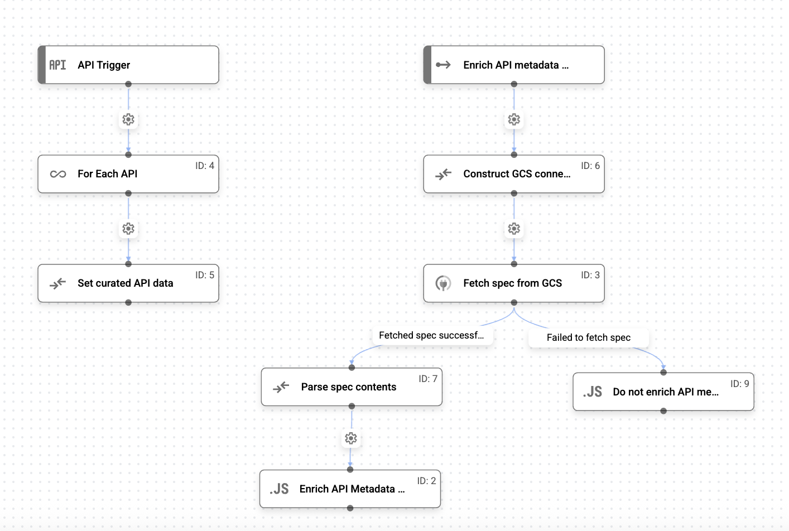

***

# Enrich API Data with Custom Curation in Apigee API Hub



This sample shows how **Apigee API hub** can be configured with custom curation logic to enrich API metadata automatically. It uses Application Integration to define a workflow that fetches OpenAPI specifications from a Cloud Storage bucket and attaches them to the corresponding API versionss registered in API hub from an Apigee instance.

## Prerequisites

*   A Google Cloud project with billing enabled.
*   The following services provisioned in your Google Cloud project:
    *   Apigee
    *   Apigee API hub
    *   Application Integration
    *   Integration Connectors
*   A service account with the following IAM roles:
    *   `roles/secretmanager.viewer`
    *   `roles/secretmanager.secretAccessor`
    *   `roles/storage.admin`
*   The Cloud Storage API enabled in your project 
*   Sample files from the tutorial downloaded to your local machine:
    *   enrich-with-spec.json
    *   specs/orders-api.yaml
    *   specs/products-api.yaml
    *   specs/users-api.yaml

## Setup instructions

### Step 1: Prepare the environment

To begin, you will prepare your Apigee, Cloud Storage, and Integration Connectors environment.

1.  **Create API Proxies in Apigee**: Register three sample API proxies (`Orders API`, `Products API`, `Users API`) in your Apigee project and ensure they are deployed ([source](https://cloud.devsite.corp.google.com/apigee/docs/apihub/tutorials/enrich-api-data?content_ref=enable%20the%20cloud%20storage%20api#create_api_proxies_in)). These will be automatically discovered by the API hub plugin.
2.  **Set up Cloud Storage**: Create a Cloud Storage bucket (e.g., `test_bucket`) ([source](https://cloud.devsite.corp.google.com/apigee/docs/apihub/tutorials/enrich-api-data?content_ref=enable%20the%20cloud%20storage%20api#set_up)). Upload the three sample API specification files (`orders-api.yaml`, `products-api.yaml`, `users-api.yaml`) to this bucket ([source](https://cloud.devsite.corp.google.com/apigee/docs/apihub/tutorials/enrich-api-data?content_ref=enable%20the%20cloud%20storage%20api#upload_api_specification_files)).
3.  **Configure Cloud Storage Connection**: In Integration Connectors, create a new Cloud Storage connection named `fetch-specs` ([source](https://cloud.devsite.corp.google.com/apigee/docs/apihub/tutorials/enrich-api-data?content_ref=enable%20the%20cloud%20storage%20api#configure_connection)). Configure it to use the service account you created earlier. This allows the integration to access the bucket.

### Step 2: Create an integration for custom curation

This step will create the custom logic in Application Integration that fetches and attaches the specs.

1.  **Create an Integration**: In the Application Integration UI, create a new integration named `test-curation` in the same region as API hub (e.g., `us-central1`) ([source](https://cloud.devsite.corp.google.com/apigee/docs/apihub/tutorials/enrich-api-data?content_ref=enable%20the%20cloud%20storage%20api#step1)).
2.  **Upload and Configure**: Upload the `enrich-with-spec-yaml.json` file to create a new version of the integration. Configure the `Fetch spec from GCS` connector task to use the `fetch-specs` connection you created ([source](https://cloud.devsite.corp.google.com/apigee/docs/apihub/tutorials/enrich-api-data?content_ref=enable%20the%20cloud%20storage%20api#configure_connector_task_in_the_integration)).
3.  **Test and Publish**: Test the integration with the sample input provided in the tutorial to ensure it correctly constructs the enriched API data payload ([source](https://cloud.devsite.corp.google.com/apigee/docs/apihub/tutorials/enrich-api-data?content_ref=enable%20the%20cloud%20storage%20api#test_and_publish_the_integration)). After a successful test, publish the integration to make it active.

### Step 3: Set up and verify custom curation in API hub

Now, you will configure API hub to use the integration you just published.

1.  **Set Up Custom Curation**: In the API hub **Settings > Curations** tab, set up a new curation named `enrich-curation` ([source](https://cloud.devsite.corp.google.com/apigee/docs/apihub/tutorials/enrich-api-data?content_ref=enable%20the%20cloud%20storage%20api#step2)). Associate it with your `test-curation` integration by selecting the correct integration and its API trigger ID.
2.  **Edit the Plugin Instance**: Navigate to the **Plugins** tab and edit the default **Apigee X and Hybrid** plugin instance ([source](https://cloud.devsite.corp.google.com/apigee/docs/apihub/tutorials/enrich-api-data?content_ref=enable%20the%20cloud%20storage%20api#step3)). Change its Curation logic from the default to your newly created `enrich-curation` custom curation.
3.  **Verify Enriched Data**: Go to the **APIs** page in API hub. After the plugin runs, you will see that the `DemoAPI` proxies are now enriched with their corresponding specification files from the Cloud Storage bucket ([source](https://cloud.devsite.corp.google.com/apigee/docs/apihub/tutorials/enrich-api-data?content_ref=enable%20the%20cloud%20storage%20api#step4)).

### Step 4: Clean up resources

To avoid incurring charges, clean up the resources created during this tutorial. You can either delete the entire Google Cloud project or delete the individual resources you created, such as the Cloud Storage bucket ([source](https://cloud.devsite.corp.google.com/apigee/docs/apihub/tutorials/enrich-api-data?content_ref=enable%20the%20cloud%20storage%20api#clean-up)).

```bash
# To delete the Cloud Storage bucket
gcloud storage buckets delete BUCKET_NAME

# To delete the project
gcloud projects delete PROJECT_ID
```

Congrats, you have successfully used Application Integration to create a custom curation workflow that automatically enriches API data in API hub from an external source.