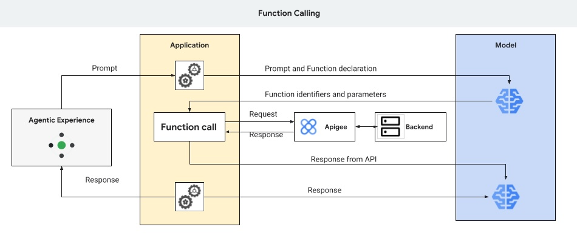

# llm-function-calling

This is a sample on how to deploy a sample Apigee proxy and configure it as a [function call](https://cloud.google.com/vertex-ai/generative-ai/docs/multimodal/function-calling).

[Function Calling in Gemini](https://cloud.google.com/vertex-ai/generative-ai/docs/multimodal/function-calling) lets developers create a description of a function in their code, then pass that description to a language model in a request. The response from the model includes the name of a function that matches the description and the arguments to call it with. This feature makes it easier for developers to get structured data outputs from generative models.

## Pre-Requisites

1. [Provision Apigee X](https://cloud.google.com/apigee/docs/api-platform/get-started/provisioning-intro)
2. Configure [external access](https://cloud.google.com/apigee/docs/api-platform/get-started/configure-routing#external-access) for API traffic to your Apigee X instance
3. Enable Vertex AI in your project

## Get started

Proceed to this [notebook](llm_function_calling.ipynb) and follow the steps in the Setup and Testing sections.
