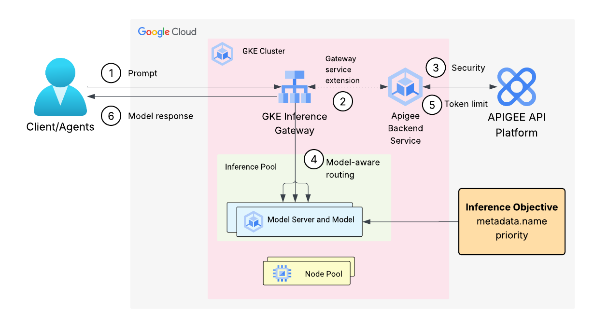

# llm-inference-gateway

- In this sample, we will cover how Apigee can be configured as an AI gateway to provide authentication, authorization and other serving capabilities like Token limiting, etc for your inference workloads. Apigee can integrate with [GKE Inference Gateway](https://cloud.google.com/kubernetes-engine/docs/concepts/about-gke-inference-gateway) to provide features like API security, rate limiting, quotas, analytics, and monetization.
- In ths sample, we will create a GKE cluster and configure a GKE Inference Gateway to optimize the serving of generative AI applications and workloads on GKE. 
- To create the cluster, we will be using [Google Cloud Accelerated Platforms ](https://github.com/GoogleCloudPlatform/accelerated-platforms/tree/hf-model-vllm-gpu-tutorial) repo, a collection of accelerated platform best practices, reference architectures, example use cases, reference implementations, and various other assets on Google Cloud.
- The sample uses [Apigee Operator for Kubernetes](https://docs.cloud.google.com/apigee/docs/api-platform/apigee-kubernetes/apigee-apim-operator-overview) that allows you to perform API management tasks, such as defining API products and operations, using Kubernetes tools. 
- We will be using `ApigeeBackendService` in this sample that uses Apigee as an extension in the [traffic extension](https://docs.cloud.google.com/kubernetes-engine/docs/how-to/configure-gke-service-extensions#configure-gcp-extensions) resource. 



The flow is as follows:
  1. A client request (prompt) is received by the GKE Inference Gateway.
  2. The configured Traffic Extension intercepts the request and forwards the payload to Apigee via the designated `ApigeeBackendService`
  3. Apigee executes the configured Request Flow policies (e.g., authentication, spike arrest, threat protection).
  4. Upon successful verification, Apigee sends the request back to the Inference Gateway which inturn sends it to the target InferencePool where the AI model processes the prompt and generates a response.
  5. The response payload is then routed back to Apigee via the Traffic Extension. Apigee applies Response Flow policies (e.g., data masking, payload validation, quota enforcement).
  6. After final verification by Apigee, the response is returned to the Inference Gateway and ultimately sent back to the calling client.

## Pre-Requisites

1. [Provision Apigee X](https://cloud.google.com/apigee/docs/api-platform/get-started/provisioning-intro)
2. Configure [external access](https://cloud.google.com/apigee/docs/api-platform/get-started/configure-routing#external-access) for API traffic to your Apigee X instance
3. Enable Google Kubernetes Engine API, Vertex AI API in your project
4. Will require roles to create GKE cluster, Load Balancer, PSC NEGs and create/deploy Apigee resources like proxies, environments, environment groups, etc. For more info, check out this [doc](https://docs.cloud.google.com/apigee/docs/api-platform/apigee-kubernetes/apigee-apim-operator-install#required-roles)
5. Make sure that you have Reserved proxy-only subnets for load balancing and Private Service Connect subnets in your VPC network. For more info about these, check this [doc](https://docs.cloud.google.com/vpc/docs/subnets#purpose)
6. Will need a Hugging Face Token. You can sign up for an account at https://huggingface.co and create an Access Token
7. Make sure the following tools are available in your terminal's $PATH (Cloud Shell has these preconfigured)
    - [gcloud SDK](https://cloud.google.com/sdk/docs/install)
    - [helm](https://helm.sh/docs/intro/install/)
    - [apigeecli](https://github.com/apigee/apigeecli)
    - unzip
    - curl
    - jq

## Step 1: Deploy open LLMs on GKE

The first step is to deploy popular open large language models (LLMs) on GKE for Inference by using Infrastructure as Code (IaC), with Terraform wrapped in CLI scripts, to create a standardized, secure, and scalable GKE environment designed for AI inference workloads. This [repo](https://github.com/GoogleCloudPlatform/accelerated-platforms/tree/hf-model-vllm-gpu-tutorial) has all the info to set it up.

Follow the steps mentioned in this [doc](https://docs.cloud.google.com/kubernetes-engine/docs/tutorials/serve-open-models-terraform) that guides you on how to deploy and serve LLMs using single-host GPU nodes on GKE with the vLLM serving framework.

Make sure you test your deployment by following the steps mentioned [here](https://docs.cloud.google.com/kubernetes-engine/docs/tutorials/serve-open-models-terraform#test-your-deployment).

### Things to consider

- You must accept the license terms for any gated models you want to use (such as Gemma or Llama) on their respective Hugging Face model page. 
- This setup guide downloads the model from Hugging Face and stores it in a GCS bucket so the model name in the API will be `/gcs/${HF_MODEL_ID}`, for example `/gcs/google/gemma-3-1b-it`.
- The setup has default variables for names of VPC network, subnets etc and the region where it gets deployed (for example `us-central1`). If you want to change any of those variables, update the appropriate values in the TF code. Those changes are beyond the scope of this sample. Please refer to the [repo](https://github.com/GoogleCloudPlatform/accelerated-platforms/tree/hf-model-vllm-gpu-tutorial) for more details.

## Step 2: Deploy GKE Inference Gateway

In this step, we will deploy the GKE Inference Gateway. The high-level workflow for configuring GKE Inference Gateway is as follows: 
  1. Create an inference pool
  2. Specify inference objectives
  3. Create the Gateway
  4. Create the HTTPRoute

**NOTE**: All the above should be configured on the same namespace as the `vllm` workloads. The namespace is created by the TF modules and available as a variable called `ira_online_gpu_kubernetes_namespace_name`.

```sh
echo "namespace is '$ira_online_gpu_kubernetes_namespace_name'"
```

### Create an inference pool

- The InferencePool Kubernetes custom resource defines a group of Pods with a common base large language model (LLM) and compute configuration. For more info, you can find [here](https://docs.cloud.google.com/kubernetes-engine/docs/how-to/deploy-gke-inference-gateway#create-inference-pool).
- Run the following command
```sh
APP=$(kubectl get pods -n $ira_online_gpu_kubernetes_namespace_name -o json | jq ."items[0].metadata.labels.app" -r)
helm install $APP \
  --set inferencePool.modelServers.matchLabels.app=$APP \
  --set provider.name=gke \
  --set inferenceExtension.monitoring.gke.enabled=true \
  --version v1.0.1 \
  oci://registry.k8s.io/gateway-api-inference-extension/charts/inferencepool \
  -n $ira_online_gpu_kubernetes_namespace_name
```

This creates an InferencePool, for example, `object: vllm-l4-gemma-3-1b-it`, referencing the model endpoint services within the Pods. It also creates a deployment of the Endpoint Picker, for example, `app:vllm-l4-gemma-3-1b-it-epp`, for this created InferencePool.

To get the InferencePool name, run 
```sh
kubectl get InferencePool -n $ira_online_gpu_kubernetes_namespace_name
```

### Specify inference objectives

In this step we configure the `InferenceObjective` that lets you specify priority of requests. Follow the steps mentioned [here](https://docs.cloud.google.com/kubernetes-engine/docs/how-to/deploy-gke-inference-gateway#specify-inference-objectives). Update the `poolRef.name` with the name of your InferencePool.

**NOTE**: Configure this `InferenceObjective` to the same namespace as the `vllm` workloads. Run the following command 
```sh
kubectl apply -f inference-objectives.yaml -n $ira_online_gpu_kubernetes_namespace_name
```

### Create the Gateway

The Gateway resource is the entry point for external traffic into your Kubernetes cluster. It defines the listeners that accept incoming connections. We will use `gke-l7-regional-external-managed` (Regional External Application Load Balancers) for our sample. Follow the steps mentioned [here](https://docs.cloud.google.com/kubernetes-engine/docs/how-to/deploy-gke-inference-gateway#create-gateway)

**NOTE**: Configure this `Gateway` to the same namespace as the `vllm` workloads. Run the following command 
```sh
kubectl apply -f gateway.yaml -n $ira_online_gpu_kubernetes_namespace_name
```

This may take a few mins to complete.

### Create the HTTPRoute

The `HTTPRoute` resource defines how the GKE Gateway routes incoming HTTP requests to backend services, such as your `InferencePool`. Follow the steps mentioned [here](https://docs.cloud.google.com/kubernetes-engine/docs/how-to/deploy-gke-inference-gateway#create-httproute)

**NOTE**: Configure this `HTTPRoute` to the same namespace as the `vllm` workloads. Run the following command 
```sh
kubectl apply -f httproute.yaml -n $ira_online_gpu_kubernetes_namespace_name
```

## Send inference request

After you have configured the GKE Inference Gateway, you can send inference requests to your deployed model. This lets you generate text based on your input prompt and specified parameters. Follow the steps mentioned [here](https://docs.cloud.google.com/kubernetes-engine/docs/how-to/deploy-gke-inference-gateway#send-inference-request).

**NOTE**: The `model` name will have the `/gcs/` prefix, so make sure you pass that in your test call. For example
```sh
curl -X POST \
  "http://$IP:$PORT/v1/completions" \
  -H "Content-Type: application/json" \
  -d @- <<EOF_JSON
{
  "model": "/gcs/$HF_MODEL_ID",
  "prompt": "What is the capital of France?",
  "max_tokens": 10,
  "temperature": 0
}
EOF_JSON
```
or

```sh
curl -X POST \
	"http://${IP}:${PORT}/v1/chat/completions" \
	-H 'Content-Type: application/json' \
	-d @- <<EOF_JSON
	{
	    "messages": [
	        {
	            "role": "user",
	            "content": "What is the capital of France?"
	        }
	    ],
	    "model": "/gcs/$HF_MODEL_ID",
	    "max_tokens": 10,
	    "stream": false
	}
EOF_JSON
```

Congratulations!! You have successfully deployed an open source model to GKE and exposed it using the GKE Inference Gateway!

## Apigee as an AI Gateway

Now that we have an Inference Gateway up and running, lets protect it using Apigee as an AI gateway for security and traffic control.

- **API Key Verification**: Implement a policy to validate API keys on every incoming request, moving beyond basic security.
- **Token Limiting**: This feature will strictly limit the number of tokens based on the subscription limits and allowances configured in the relevant AI Product (API Product). Requests exceeding the specified threshold will be automatically rejected.
- **Add more LLM serving patterns**: Other features like semantic caching, sanitizing prompts, LLM logging, etc can be added to the proxy as well. For more LLM serving use cases, refer to this [repo](https://github.com/GoogleCloudPlatform/apigee-samples?tab=readme-ov-file#samples-for-llm-serving-with-apigee).

## Step 1: Install the Apigee APIM Operator

- Follow the steps provided in this [doc](https://docs.cloud.google.com/apigee/docs/api-platform/apigee-kubernetes/apigee-apim-operator-install). Please follow the entire step end to end.
- Make sure you have the Apigee environment created in the same region as the GKE cluster.

## Step 2: Create an ApigeeBackendService

**NOTE:** Please proceed with the steps only if you have completed the Apigee APIM Operator installation mentioned above.

1. Set the following environment variables
```sh
export PROJECT_ID=<GCP_Project_ID>
export APIGEE_ENV=<Apigee_APIM_Env> #apim-enabled-dep-env
export APIGEE_REGION=<Apigee_APIM_Env_Region> #us-central1
export NETWORK=<GKE_Cluster_Network> #acp-dev
export SUBNET=<GKE_Cluster_Network_Subnet> #acp-dev
```
2. Make sure you have a subnet dedicated to use with Private Service Connect (PSC). To create, refer to this [doc](https://docs.cloud.google.com/vpc/docs/configure-private-service-connect-producer#add-subnet-psc).
3. Create the `ApigeeBackendService` resource
```sh
cat <<-'EOF' | envsubst > apigee-backendservice.yaml
apiVersion: apim.googleapis.com/v1
kind: ApigeeBackendService
metadata:
  name: apigee-llm-inf-gw
spec:
  apigeeEnv: $APIGEE_ENV
  defaultSecurityEnabled: true
  locations:
    - name: $APIGEE_REGION
      network: projects/$PROJECT_ID/global/networks/$NETWORK
      subnetwork: projects/$PROJECT_ID/regions/$APIGEE_REGION/subnetworks/$SUBNET
EOF
```
4. Apply the file
```sh
kubectl apply -f apigee-backendservice.yaml -n $ira_online_gpu_kubernetes_namespace_name
```
5. Verify and make sure the state is `CREATED`
```sh
kubectl get apigeebackendservice -n $ira_online_gpu_kubernetes_namespace_name
```

## Step 3: Create a GCPTrafficExtension resource

1. Get the Inference Gateway and ApigeeBackendService resource names by running the following command
```sh
export INFERENCE_GATEWAY_NAME=$(kubectl get gateways -n $ira_online_gpu_kubernetes_namespace_name -o json | jq ."items[0].metadata.name" -r)
export APIGEE_BACKENDSERVICE_NAME=$(kubectl get ApigeeBackendService -n $ira_online_gpu_kubernetes_namespace_name -o json | jq ."items[0].metadata.name" -r)
```
2. Create the `GCPTrafficExtension` resource
```sh
cat <<-'EOF' | envsubst > gcp-traffic-extension.yaml
kind: GCPTrafficExtension
apiVersion: networking.gke.io/v1
metadata:
  name: demo-apigee-extension
spec:
  targetRefs:
  - group: "gateway.networking.k8s.io"
    kind: Gateway
    name: $INFERENCE_GATEWAY_NAME
  extensionChains:
  - name: my-chain1
    matchCondition:
      celExpressions:
      - celMatcher: request.path.startsWith("/")
    extensions:
    - name: my-apigee-extension
      metadata:
          apigee-extension-processor : $APIGEE_BACKENDSERVICE_NAME
          apigee-request-body: 'true'
          apigee-response-body: 'true'
      failOpen: false
      requestBodySendMode: FullDuplexStreamed
      responseBodySendMode: FullDuplexStreamed
      supportedEvents:
      - RequestHeaders
      - RequestBody
      - RequestTrailers
      - ResponseHeaders
      - ResponseBody
      - ResponseTrailers
      timeout: 1s
      backendRef:
        group: "apim.googleapis.com"
        kind: ApigeeBackendService
        name: $APIGEE_BACKENDSERVICE_NAME
EOF
```
3. Apply the file
```sh
kubectl apply -f gcp-traffic-extension.yaml -n $ira_online_gpu_kubernetes_namespace_name
```
4. Confirm that the GCPTrafficExtension status conditions include `Accepted=True` and `ResolvedRefs=True`
  ```sh
  kubectl wait GCPTrafficExtension demo-apigee-extension -n $ira_online_gpu_kubernetes_namespace_name \
  --for=jsonpath='{.status.ancestors[0].conditions[?(@.type=="Accepted")].status}'=True \
  --for=jsonpath='{.status.ancestors[0].conditions[?(@.type=="ResolvedRefs")].status}'=True \
  --timeout=5m
  ```
5. Send a Request to Model Backend to Verify Inference Gateway. (NOTE: This can take a few minutes)   
```sh
curl -X POST \
  "http://$IP:$PORT/v1/completions" \
  -H "Content-Type: application/json" \
  -d @- <<EOF_JSON
{
  "model": "/gcs/$HF_MODEL_ID",
  "prompt": "What is the capital of France?",
  "max_tokens": 10,
  "temperature": 0
}
EOF_JSON
``` 
or
```sh
curl -X POST \
	"http://${IP}:${PORT}/v1/chat/completions" \
	-H 'Content-Type: application/json' \
	-d @- <<EOF_JSON
	{
	    "messages": [
	        {
	            "role": "user",
	            "content": "What is the capital of France?"
	        }
	    ],
	    "model": "/gcs/$HF_MODEL_ID",
	    "max_tokens": 10,
	    "stream": false
	}
EOF_JSON
```
You should see an error. Something like

```json
{
    "fault": {
        "faultstring": "Raising fault. Fault name : RF-insufficient-request-raise-fault",
        "detail": {
            "errorcode": "steps.raisefault.RaiseFault"
        }
    }
}
```

## Step 4: Create the Apigee API Product, Developer and Developer App

1. Create an API Product
```sh
cat <<-'EOF' | envsubst > apigee-apiproduct.yaml
apiVersion: apim.googleapis.com/v1
kind: APIProduct
metadata:
  name: api-inf-gw-product
spec:
  approvalType: auto
  description: Inference Gateway API Product
  displayName: api-inf-gw-product
  enforcementRefs:
    - name: $APIGEE_BACKENDSERVICE_NAME
      kind: ApigeeBackendService
      group: apim.googleapis.com
      namespace: $ira_online_gpu_kubernetes_namespace_name
  attributes:
    - name: access
      value: private
EOF
```
2. Apply the file
```sh
kubectl apply -f apigee-apiproduct.yaml -n $ira_online_gpu_kubernetes_namespace_name
```
3. Create an API Product Operation Set
```sh
cat <<-'EOF' | envsubst > apigee-apiproduct-ops.yaml
apiVersion: apim.googleapis.com/v1
kind: APIOperationSet
metadata:
  name: item-set
spec:
  apiProductRefs:
    - name: api-inf-gw-product
      kind: APIProduct
      group: apim.googleapis.com
      namespace: $ira_online_gpu_kubernetes_namespace_name
  quota:
    limit: 100
    interval: 1
    timeUnit: minute
  restOperations:
    - name: "Completions"
      path: /v1/completions
      methods:
        - POST
    - name: "Chat Completions"
      path: /v1/chat/completions
      methods:
        - POST
EOF
```
4. Apply the file
```sh
kubectl apply -f apigee-apiproduct-ops.yaml -n $ira_online_gpu_kubernetes_namespace_name
```
5. Go to the Apigee API management page in the Google Cloud console, create a Developer.
6. Once the developer is created, create a Developer App. Make sure to select the `api-inf-gw-product` product. Make a note of the API Key generated
```sh
export APIKEY="APIKEY_TO_SET"
```
7. Send a Request to Model Backend to Verify Inference Gateway
```sh
curl -X POST \
  "http://$IP:$PORT/v1/completions" \
  -H "x-api-key: $APIKEY" \
  -H "Content-Type: application/json" \
  -d @- <<EOF_JSON
{
  "model": "/gcs/$HF_MODEL_ID",
  "prompt": "What is the capital of France?",
  "max_tokens": 10,
  "temperature": 0
}
EOF_JSON
``` 
or
```sh
curl -X POST \
	"http://${IP}:${PORT}/v1/chat/completions" \
	-H 'Content-Type: application/json' \
	-H "x-api-key: $APIKEY" \
	-d @- <<EOF_JSON
	{
	    "messages": [
	        {
	            "role": "user",
	            "content": "What is the capital of France?"
	        }
	    ],
	    "model": "/gcs/$HF_MODEL_ID",
	    "max_tokens": 10,
	    "stream": false
	}
EOF_JSON
```
You should see a valid response. If you find any issues, please use the troubleshooting [guide](https://docs.cloud.google.com/apigee/docs/api-platform/apigee-kubernetes/apigee-apim-operator-troubleshoot) available in the public docs.

## Adding more AI gateway capabilities

The initial proxy deployed just includes basic security features, we can extend the capabilities by adding other policies to the same proxy. In the following steps, you will deploy another proxy that has other capabilities like Token Limiting. 

To deploy the proxy:

1. Set the following environment variables
```sh
export PROJECT_ID=<GCP_Project_ID>
export APIGEE_ENV=<Apigee_APIM_Env> #apim-enabled-dep-env
```
2. Assuming you are still in the `accelerated-platforms` directory in your terminal. Run the following commands to clone the apigee-samples repo
```sh
cd ..
git clone https://github.com/GoogleCloudPlatform/apigee-samples.git
cd llm-inference-gateway
```
3. Execute the deployment script that will deploy a new Apigee proxy with additional policies with AI Gateway capabilities
```sh
./deploy-apigee-llm.sh
```

Once the script is run successfully, run the curl command to test the functionality

```sh
curl -X POST \
  "http://$IP:$PORT/v1/completions" \
  -H "x-api-key: $APIKEY" \
  -H "Content-Type: application/json" \
  -d @- <<EOF_JSON
{
  "model": "/gcs/$HF_MODEL_ID",
  "prompt": "What is the capital of France?",
  "max_tokens": 10,
  "temperature": 0
}
EOF_JSON
```
or
```sh
curl -X POST \
	"http://${IP}:${PORT}/v1/chat/completions" \
	-H 'Content-Type: application/json' \
	-H "x-api-key: $APIKEY" \
	-d @- <<EOF_JSON
	{
	    "messages": [
	        {
	            "role": "user",
	            "content": "What is the capital of France?"
	        }
	    ],
	    "model": "/gcs/$HF_MODEL_ID",
	    "max_tokens": 10,
	    "stream": false
	}
EOF_JSON
```

Make multiple calls and you will notice that an error will occur once it hits the token limit. For example

```json
{
    "fault": {
        "faultstring": "Rate limit quota violation. Quota limit  exceeded.",
        "detail": {
            "errorcode": "policies.ratelimit.QuotaViolation"
        }
    }
}
```

## Disclaimer

This sample references GCP public documentation, which is subject to change (e.g., product updates, new features, or changes to the Google Cloud Accelerated Platforms repo). If you find a mismatch between the sample instructions and the underlying documentation, please open a GitHub [Issue](https://github.com/GoogleCloudPlatform/apigee-samples/issues).