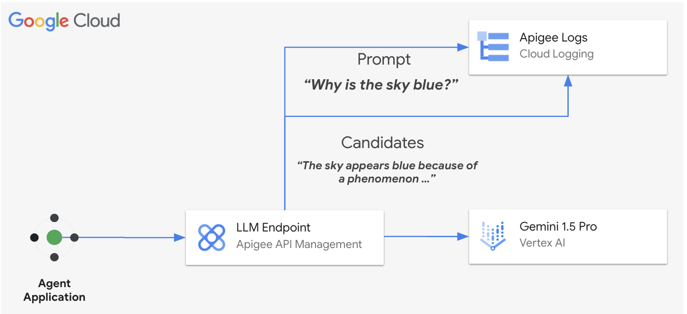

# **LLM Serving with Apigee**

## [Logging Sample](llm_logging_v1.ipynb)

Logging both prompts and candidate responses from large language models (LLMs) allows for detailed analysis and improvement of the model's performance over time. By examining past interactions, AI practitioners can identify patterns leading to refinements in the training data or model architecture. Furthermore, by examining the prompts security teams can detect malicious intent, such as attempts to extract sensitive information or generate harmful content.

Additionally, logging the generated candidates provides insights into the LLM's behavior and helps identify any biases or vulnerabilities in the model itself. This information can then be used to improve security measures, fine-tune the model, and mitigate potential risks associated with LLM usage.

# Benefits of Logging with Apigee and Google Cloud Logging

* **Seamless logging**: Effortlessly capture prompts, candidate responses, and metadata without complex coding.
* **Scalable and secure**: Leverage Google Cloud's infrastructure for reliable and secure log management.

## Get started

Proceed to this [notebook](llm_logging_v1.ipynb) and follow the steps in the Setup and Testing sections.