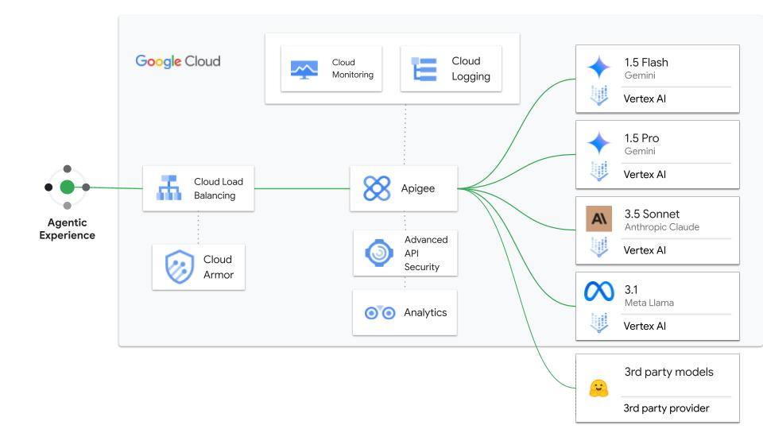

# llm-routing

- This is a sample Apigee proxy to demonstrate the routing capabilities of Apigee across different LLM providers. In this sample we will use Google VertexAI and Anthropic as the LLM providers
- The framework will easily help onboarding other providers using configurations



## Pre-Requisites

1. [Provision Apigee X](https://cloud.google.com/apigee/docs/api-platform/get-started/provisioning-intro)
2. Configure [external access](https://cloud.google.com/apigee/docs/api-platform/get-started/configure-routing#external-access) for API traffic to your Apigee X instance
3. Enable Vertex AI in your project
4. Enable Anthropic in your [Vertex AI Model Garden](https://cloud.google.com/model-garden)
5. Make sure the following tools are available in your terminal's $PATH (Cloud Shell has these preconfigured)
    - [gcloud SDK](https://cloud.google.com/sdk/docs/install)
    - [apigeecli](https://github.com/apigee/apigeecli)
    - unzip
    - curl
    - jq

## Routing Logic

The sample uses the [Key Value Map](https://cloud.google.com/apigee/docs/api-platform/cache/key-value-maps) to store the different LLM provider configurations. In this sample, we will create a KVM called `llm-routing-config` which will contain the following target URL configurations for each provider.
  
You can refer to this sample [keyvalue map file](./config/env__envname__llm-routing-config__kvmfile__0.json) that contains the configurations for each provider.

**NOTE:** The `{model}` in the Key Value Map is automically replaced with the model passed in the request by Apigee using Message Template

## Payload

The URL path of the API consists of the provider and the model params, for example `/providers/google/models/gemini-1.5-flash-001` or `/anthropic/models/claude-3-5-sonnet-v2@20241022` which is used by the proxy to do the config lookup and route the calls to the actual provider.

The request payload must match to the provider's specification. 

`x-log-payload` is a header you can use for Apigee to log the calls to Cloud Logging. To log pass the header value as `true`

Similarly, the response sent from the provider is returned as is and Apigee just forwards the response back to the calling client

## (QuickStart) Setup using CloudShell

Use the following GCP CloudShell tutorial, and follow the instructions.

[](https://ssh.cloud.google.com/cloudshell/open?cloudshell_git_repo=https://github.com/ssvaidyanathan/apigee-samples&cloudshell_git_branch=main&cloudshell_workspace=.&cloudshell_tutorial=llm-routing/docs/cloudshell-tutorial.md)

## Setup instructions

1. Clone this repo, and switch the cloud-logging directory

```sh
git clone https://github.com/ssvaidyanathan/apigee-samples.git
cd apigee-samples/llm-routing
```

2. Edit the `env.sh` and configure all the ENV variables

Now source the `env.sh` file

```sh
source ./env.sh
```

## Deploy Apigee artifacts

```sh
./deploy-llm-routing.sh
```

## Test the API

You can test the sample with the following curl commands:

### To Gemini

```sh
PROVIDER=google
MODEL=gemini-1.5-flash-001
curl --location "https://$APIGEE_HOST//v1/samples/llm-routing/providers/$PROVIDER/models/$MODEL:generateText" \
--header "Content-Type: application/json" \
--header "x-log-payload: false" \
--header "x-apikey: $APP_CLIENT_ID" \
--data '{
      "contents":{
         "role":"user",
         "parts":[
            {
               "text":"Suggest name for a flower shop"
            }
         ]
      }
}'
```

### To Anthropic

```sh
PROVIDER=anthropic
MODEL=claude-3-5-sonnet-v2@20241022
curl --location "https://$APIGEE_HOST/v1/samples/llm-routing/providers/$PROVIDER/models/$MODEL:generateText" \
--header "Content-Type: application/json" \
--header "x-log-payload: false" \
--header "x-apikey: $APP_CLIENT_ID" \
--data '{
    "anthropic_version": "vertex-2023-10-16",
    "messages": [
        {
            "role": "user",
            "content": [
                {
                    "type": "text",
                    "text": "Suggest name for a flower shop"
                }
            ]
        }
    ],
    "max_tokens": 256,
    "stream": false
}'
```

## Cleanup

If you want to clean up the artifacts from this example in your Apigee Organization, first source your `env.sh` script, and then run

```bash
./clean-up-llm-routing.sh
```
