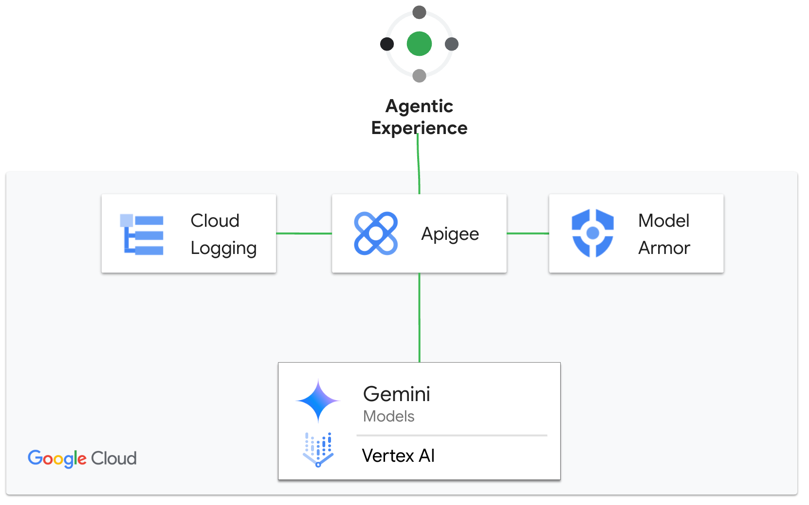

# llm-security V2

This is a sample Apigee proxy to demonstrate the security capabilities of Apigee
with [Model Armor](https://docs.cloud.google.com/model-armor/overview) to secure the user prompts. In this sample, we will use the out
of the box Model Armor policies
([SanitizeUserPrompt](https://docs.cloud.google.com/apigee/docs/api-platform/reference/policies/sanitize-user-prompt-policy)
and
[SanitizeModelResponse](https://docs.cloud.google.com/apigee/docs/api-platform/reference/policies/sanitize-llm-response-policy))
to inspect the prompt and response.



This sample differs from the related [llm-security](../llm-security/) sample,
only in how the calls to Model Armor are made. This sample uses the
purpose-built policies; the other sample uses a ServiceCallout to connect to
Model Armor. Both approaches work.

## Pre-Requisites

1. [Provision Apigee X](https://cloud.google.com/apigee/docs/api-platform/get-started/provisioning-intro)

2. Configure [external access](https://cloud.google.com/apigee/docs/api-platform/get-started/configure-routing#external-access)
   for API traffic to your Apigee X instance

3. Enable Vertex AI and Model Armor in your project.  To do so, you can use the
   [APIs & Services](https://console.cloud.google.com/apis/library) module in
   Cloud Console. Or, you can run the following commands:

   ```sh
   PROJECT_ID=<project-id>
   gcloud services enable modelarmor.googleapis.com --project="$PROJECT_ID"
   gcloud services enable aiplatform.googleapis.com --project "$PROJECT_ID"
   ```

4. _Optionally_, if you are using Private Google Access and Private Service
   Connect, or if you have regional data residency or sovereignty requirements,
   you can configure gcloud to use API endpoint overrides for subsequent gcloud
   commands. For specific regions that are supported, check the [data
   residency](https://docs.cloud.google.com/model-armor/data-residency) page.

   ```sh
   MODEL_ARMOR_REGION=<region>
   gcloud config set api_endpoint_overrides/modelarmor "https://modelarmor.$MODEL_ARMOR_REGION.rep.googleapis.com/"
   ```

5. Create a Model Armor template. This template configures how Model Armor scans
   prompts and responses, and the template ID is needed to deploy the proxy. If
   you do not have a template, you can run the following commands. Regarding the
   region, to learn the specific regions that are supported, check the [data
   residency](https://docs.cloud.google.com/model-armor/data-residency) page.

   ```sh
   PROJECT_ID=<project-id>
   MODEL_ARMOR_REGION=<region>
   TEMPLATE_ID=apigee-modelarmor-template

   gcloud model-armor templates create -q --location $MODEL_ARMOR_REGION "$TEMPLATE_ID" --project="$PROJECT_ID" \
     --basic-config-filter-enforcement=enabled \
     --pi-and-jailbreak-filter-settings-enforcement=enabled \
     --pi-and-jailbreak-filter-settings-confidence-level=LOW_AND_ABOVE \
     --malicious-uri-filter-settings-enforcement=enabled \
     --rai-settings-filters='[
         {
             "filterType": "HATE_SPEECH",
             "confidenceLevel": "MEDIUM_AND_ABOVE"
         },
         {
             "filterType": "HARASSMENT",
             "confidenceLevel": "MEDIUM_AND_ABOVE"
         },
         {
             "filterType": "SEXUALLY_EXPLICIT",
             "confidenceLevel": "MEDIUM_AND_ABOVE"
         }
     ]'
   ```

6. Make sure the following tools are available in your terminal's $PATH (Cloud Shell has these preconfigured)
    - [gcloud CLI](https://cloud.google.com/sdk/docs/install)
    - [apigeecli](https://github.com/apigee/apigeecli)
    - unzip
    - curl
    - jq

## Get started

Proceed to this [notebook](llm_security_v2.ipynb) and follow the steps in the Setup and Testing sections.

## Manual Setup instructions

If you've clicked the blue button above, you can ignore the rest of this README.
If you choose _not_ to follow the tutorial in Cloud Shell, you can follow these
steps on your own.  You can do this from any bash shell.  Google Cloud Shell
works, but you can use a shell on your own machine.

1. Edit `env.sh` and configure the variables listed there. These should all be self-explanatory.

   Open a terminal session, and source the modified `env.sh` file

   ```bash
   source ./env.sh
   ```

2. Configure the API proxy, sharedflow, API product, developer, app, and service
   account, into your Apigee organization. NB: This script will also optionally
   install apigeecli if you do not have it installed.

   ```bash
   ./deploy-llm-security-v2.sh
   ```

   When this script completes, it will print some information about the
   credentials it has provisioned, including some sample curl commands to
   exercise the proxies.

3. You can then use the example curl commands to send requests into Apigee, and
   see that model armor is protecting requests.

## Manual Cleanup instructions

In your terminal session, make sure you source the modified `env.sh` file, and then run
the clean-up script:

```bash
source ./env.sh
clean-up-llm-security-v2.sh
```
