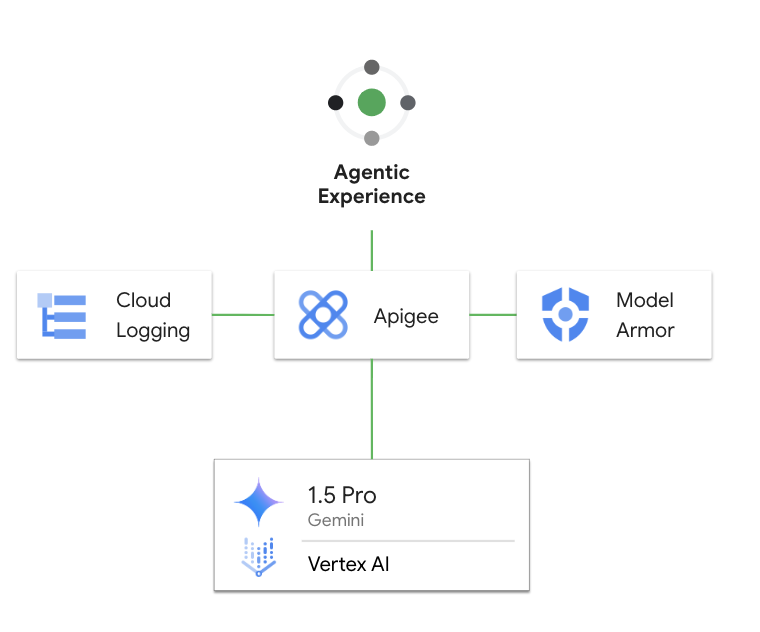

# llm-security

This is a sample Apigee proxy to demonstrate the security capabilities of Apigee
with [Model Armor](https://docs.cloud.google.com/model-armor/overview) to secure
the user prompts. In this sample, we are using
[ServiceCallout](https://docs.cloud.google.com/apigee/docs/api-platform/reference/policies/service-callout-policy)
policies to invoke Model Armor.  You can bring your own service and integrate
with Apigee using these callout policies.



This sample differs from the related [llm-security-v2](../llm-security-v2/)
sample, only in how the calls to Model Armor are made. This sample uses a
ServiceCallout to connect to ModelArmor; the other sample uses the purpose-built
policies.  Both approaches work.

## Pre-Requisites

1. [Provision Apigee X](https://cloud.google.com/apigee/docs/api-platform/get-started/provisioning-intro)

2. Configure [external access](https://cloud.google.com/apigee/docs/api-platform/get-started/configure-routing#external-access)
   for API traffic to your Apigee X instance

3. Enable Vertex AI and Model Armor in your project.  To do so, you can use the
   [APIs & Services](https://console.cloud.google.com/apis/library) module in
   Cloud Console. Or, you can run the following commands:

   ```sh
   PROJECT_ID=<project-id>
   gcloud services enable modelarmor.googleapis.com --project="$PROJECT_ID"
   gcloud services enable aiplatform.googleapis.com --project "$PROJECT_ID"
   ```

4. Create a Model Armor template. This template configures how Model Armor scans
   prompts and responses, and the template ID is needed to deploy the proxy. If
   you do not have a template, you can run the following commands

   ```sh
   PROJECT_ID=<project-id>
   MODEL_ARMOR_REGION=<region> # see https://docs.cloud.google.com/model-armor/data-residency
   TEMPLATE_ID=apigee-modelarmor-template

   gcloud config set api_endpoint_overrides/modelarmor "https://modelarmor.$MODEL_ARMOR_REGION.rep.googleapis.com/"

   gcloud model-armor templates create -q --location $MODEL_ARMOR_REGION "$TEMPLATE_ID" --project="$PROJECT_ID" \
     --rai-settings-filters='[{ "filterType": "HATE_SPEECH", "confidenceLevel": "MEDIUM_AND_ABOVE" },{ "filterType": "HARASSMENT", "confidenceLevel": "MEDIUM_AND_ABOVE" },{ "filterType": "SEXUALLY_EXPLICIT", "confidenceLevel": "MEDIUM_AND_ABOVE" }]' \
     --basic-config-filter-enforcement=enabled  \
     --pi-and-jailbreak-filter-settings-enforcement=enabled \
     --pi-and-jailbreak-filter-settings-confidence-level=LOW_AND_ABOVE \
     --malicious-uri-filter-settings-enforcement=enabled
   ```

5. Make sure the following tools are available in your terminal's $PATH (Cloud Shell has these preconfigured)
    - [gcloud CLI](https://cloud.google.com/sdk/docs/install)
    - [apigeecli](https://github.com/apigee/apigeecli)
    - unzip
    - curl
    - jq

## Get started

Proceed to this [notebook](llm_security_v1.ipynb) and follow the steps in the Setup and Testing sections.
