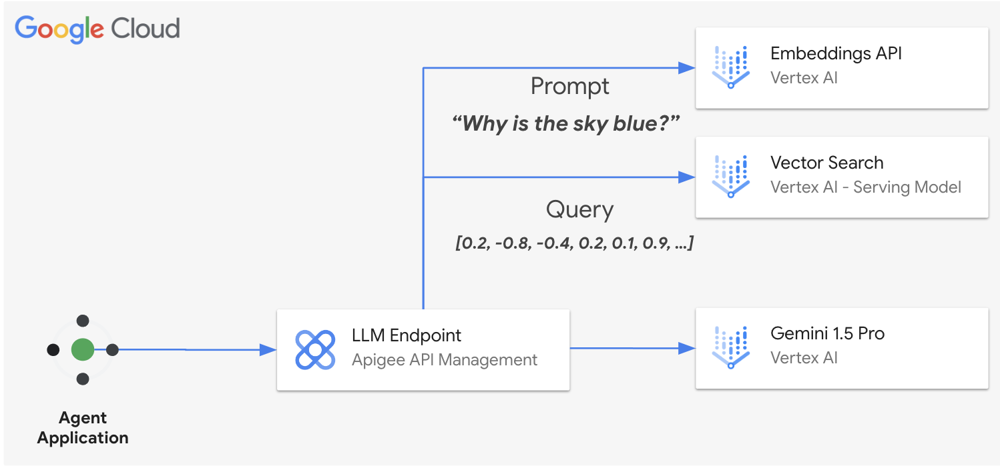

# **Apigee as AI Gateway**

## [Semantic Cache Sample](llm_semantic_cache_v1.ipynb)

This sample performs a cache lookup of responses on Apigee's Cache layer and Vector Search as an embeddings database. It operates by comparing the vector proximity of the prompt to prior requests and using a configurable similarity score threshold.

## Benefits of a Semantic Cache Layer with Apigee:

* Reduced Response Times: The cache layer significantly reduces response times for repeated queries, as Apigee efficiently stores and retrieves frequently accessed data.
* Improved Efficiency: By leveraging the caching capabilities of Apigee, unnecessary calls to the underlying model will be minimized, leading to optimized LLM costs.
* Scalability: The Apigee Cache Layer is managed and distributed, enhancing platform scalability without operational overhead.

## Get started

Proceed to this [notebook](llm_semantic_cache_v1.ipynb) and follow the steps in the Setup and Testing sections.