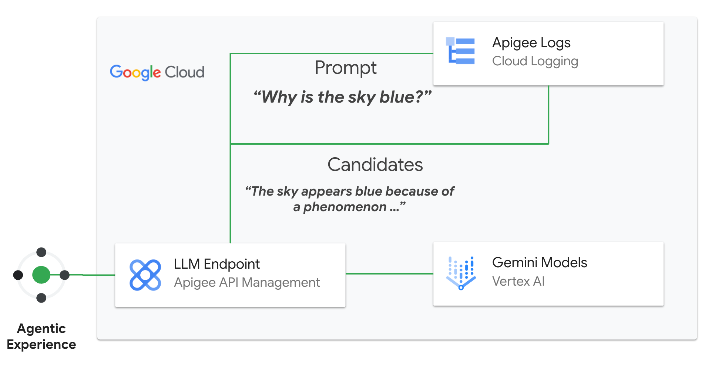

# Logging Streaming server-sent events using Apigee

- This is a sample Apigee proxy to demonstrate Apigee with LLM workloads that streams server-sent events (SSE). SSE streaming reduces latency, and clients can receive response data as soon as it is generated by an LLM. This feature supports the use of AI agents that operate in real time environments, such as customer service bots or workflow orchestrators. For more info, check out this [page](https://cloud.google.com/apigee/docs/api-platform/develop/server-sent-events)
- In this sample, we will showcase how Apigee can extract the events from the target, consolidate them and send that to Cloud Logging

## Pre-Requisites

1. [Provision Apigee X](https://cloud.google.com/apigee/docs/api-platform/get-started/provisioning-intro)
2. Configure [external access](https://cloud.google.com/apigee/docs/api-platform/get-started/configure-routing#external-access) for API traffic to your Apigee X instance
3. Enable Vertex AI and Cloud Logging in your project
4. Make sure the following tools are available in your terminal's $PATH (Cloud Shell has these preconfigured)
    - [gcloud SDK](https://cloud.google.com/sdk/docs/install)
    - [apigeecli](https://github.com/apigee/apigeecli)
    - unzip
    - curl
    - jq

## Get started

Proceed to this [notebook](llm_sse_logging_v1.ipynb) and follow the steps in the Setup and Testing sections.