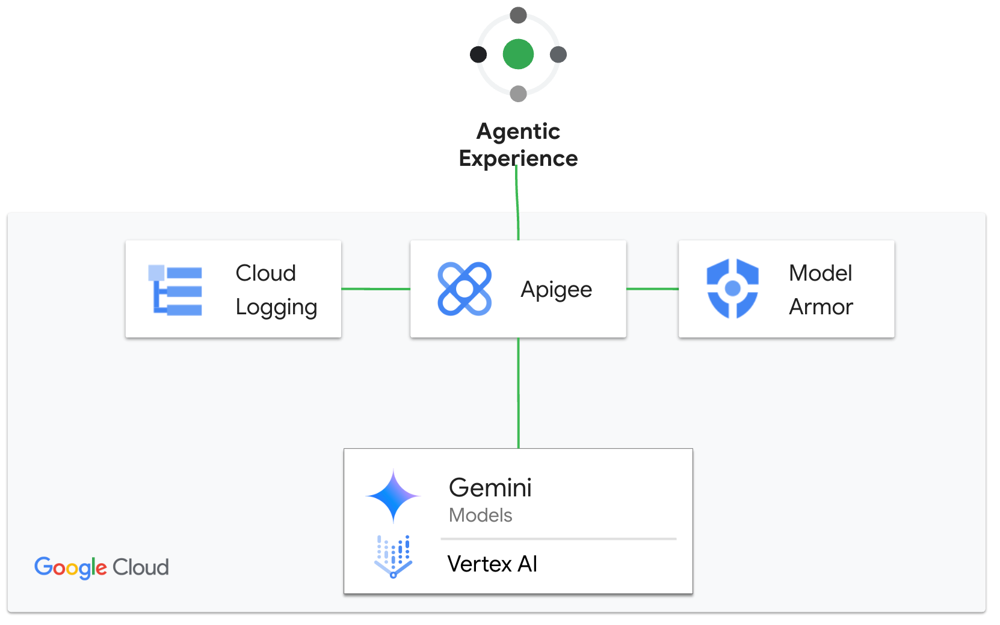

# Apigee with Streaming server-sent events

- This is a sample Apigee proxy to demonstrate Apigee with LLM workloads that streams server-sent events (SSE). SSE streaming reduces latency, and clients can receive response data as soon as it is generated by an LLM. This feature supports the use of AI agents that operate in real time environments, such as customer service bots or workflow orchestrators. For more info, check out this [page](https://cloud.google.com/apigee/docs/api-platform/develop/server-sent-events)
- In this sample, we will showcase how Apigee can extract the events from the target and send that to Model Armor to sanitize the model response. For information about Model Armor, see [Model Armor overview](https://cloud.google.com/security-command-center/docs/model-armor-overview)



## Pre-Requisites

1. [Provision Apigee X](https://cloud.google.com/apigee/docs/api-platform/get-started/provisioning-intro)
2. Configure [external access](https://cloud.google.com/apigee/docs/api-platform/get-started/configure-routing#external-access) for API traffic to your Apigee X instance
3. Enable Vertex AI in your project
4. Enable Model Armor in your project and create a template. This template ID is needed to deploy the proxy. If you do not have a template, you can run the following commands

```sh
PROJECT_ID=<project-id>
MODEL_ARMOR_REGION=<region>
TEMPLATE_ID=apigee-modelarmor-template

gcloud services enable modelarmor.googleapis.com --project="$PROJECT_ID"
gcloud config set api_endpoint_overrides/modelarmor "https://modelarmor.$MODEL_ARMOR_REGION.rep.googleapis.com/"

gcloud model-armor templates create -q --location $MODEL_ARMOR_REGION "$TEMPLATE_ID" --project="$PROJECT_ID" \
  --rai-settings-filters='[{ "filterType": "HATE_SPEECH", "confidenceLevel": "MEDIUM_AND_ABOVE" },{ "filterType": "HARASSMENT", "confidenceLevel": "MEDIUM_AND_ABOVE" },{ "filterType": "SEXUALLY_EXPLICIT", "confidenceLevel": "MEDIUM_AND_ABOVE" }]' \
  --basic-config-filter-enforcement=enabled  \
  --pi-and-jailbreak-filter-settings-enforcement=enabled \
  --pi-and-jailbreak-filter-settings-confidence-level=MEDIUM_AND_ABOVE \
  --malicious-uri-filter-settings-enforcement=enabled
```

5. Make sure the following tools are available in your terminal's $PATH (Cloud Shell has these preconfigured)
    - [gcloud SDK](https://cloud.google.com/sdk/docs/install)
    - [apigeecli](https://github.com/apigee/apigeecli)
    - unzip
    - curl
    - jq

## Get started

Proceed to this [notebook](llm_sse_security_v1.ipynb) and follow the steps in the Setup and Testing sections.
