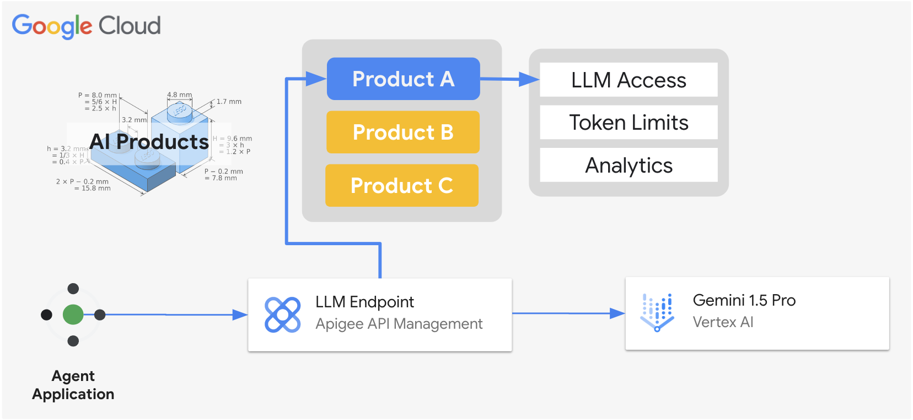

# **LLM Serving with Apigee**

## [Token Limits Sample](llm_token_limits.ipynb)

Every interaction with an LLM consumes tokens, therefore, LLM token management plays a crucial role in maintaining platform-level control and visibility over the consumption of tokens across LLM providers and consumers.

Apigee's API Products, when applied to token consumption, allows you to effectively manage token usage by setting limits on the number of tokens consumed per LLM consumer. This policy leverages the token usage metrics provided by an LLM, enabling real-time monitoring and enforcement of limits.

# Benefits Token Limits with AI Products

Creating Product tiers within Apigee allows for differentiated token quotas based for each consumer. This enables you to:

* **Control token allocation**: Prioritize resources for high-priority consumers by allocating higher token quotas to their tiers. This will also help to manage platform-wide token budgets across multiple LLM providers.
* **Tiered AI products**: By utilizing product tiers with granular token quotas, Apigee effectively manages LLM and empowers AI platform teams to manage costs and provide a multi-tenant platform experience.

## Get started

Proceed to this [notebook](llm_token_limits.ipynb) and follow the steps in the Setup and Testing sections.