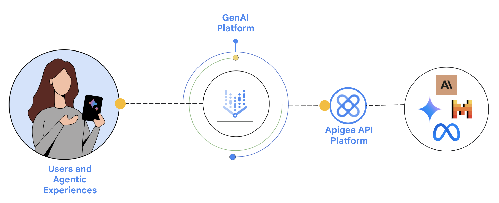

# llm-vertexai-agent

This is a sample on how to deploy a sample Apigee proxy and configure it as a tool in [Conversational Agents](https://cloud.google.com/dialogflow/cx/docs).

## Pre-Requisites

1. [Provision Apigee X](https://cloud.google.com/apigee/docs/api-platform/get-started/provisioning-intro)
2. Configure [external access](https://cloud.google.com/apigee/docs/api-platform/get-started/configure-routing#external-access) for API traffic to your Apigee X instance
3. Enable Vertex AI and DialogFlow in your project

## Get started

Proceed to this [notebook](llm_vertexai_agent.ipynb) and follow the steps in the Setup and Testing sections.
