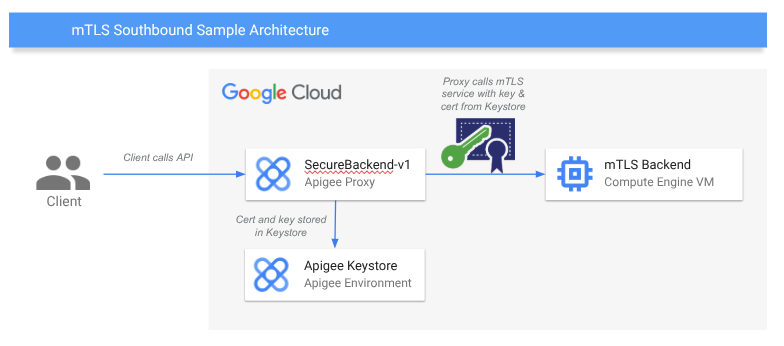

# Apigee Mutual TLS Southbound Security

This sample shows how to configure mTLS for southbound services from an Apigee proxy.



## About mTLS for Apigee southbound connections

- [Apigee Docs on TLS](https://cloud.google.com/apigee/docs/api-platform/system-administration/options-configuring-tls)

## Prerequisites
- [gcloud CLI](https://cloud.google.com/sdk/docs/install) will be used for automating GCP tasks, see the docs site for installation instructions.
- [apigeecli](https://github.com/apigee/apigeecli) will be used for Apigee automation, see the docs site for installation instructions.
- GCP roles needed:
  - roles/compute.instanceAdmin - needed to create a VM.
  - roles/compute.networkAdmin - needed to create a firewall rule to allow the VM to get scp commands on port 22.
  - roles/apigee.apiAdminV2 - needed to deploy an Apigee proxy.
  - roles/apigee.environmentAdmin - needed to manage the Keystore and Target configuration.

## (QuickStart) Setup using CloudShell

Use the following GCP CloudShell tutorial, and follow the instructions in Cloud Shell. Alternatively, follow the instructions below.

[](https://ssh.cloud.google.com/cloudshell/open?cloudshell_git_repo=https://github.com/GoogleCloudPlatform/apigee-samples&cloudshell_git_branch=main&cloudshell_workspace=.&cloudshell_tutorial=mtls-southbound/docs/cloudshell-tutorial.md)

## Setup instructions

### Step 1: Set your GCP project environment variables

To begin, set your environment variables to be used in the `env.sh` file.

* `PROJECT_ID` the project where your Apigee organization is located.
* `REGION` the externally reachable hostname of the Apigee environment group that contains APIGEE_ENV.
* `APIGEE_ENV` the Apigee environment where the demo resources should be created.
* `APIGEE_HOST` the Apigee host of the environment / environment group to reach the proxy
* `ZONE` the GCP zone where a test southbound mtls VM should be deployed.
* `VM_NAME` the name of the test VM to be created.

Now source the file.

```sh
source env.sh
```

### Step 2: Create a VM with nginx using mTLS

If you already have an mTLS endpoint with certificate and key, you can skip this step. First we will create two firewall rules to allow traffic to the VM, and then we will create a small VM with [nginx](https://nginx.org/) running to handle the mTLS backend requests.

```sh
# create firewall rules for port 22.
gcloud compute firewall-rules create allow22 --allow tcp:22 --project $PROJECT_ID --target-tags allow22

# create our backend VM, with a startup script to install nginx and let us write files to the /etc/nginx dir.
gcloud compute instances create $VM_NAME \
  --project=$PROJECT_ID \
  --zone=$ZONE \
  --image=debian-12-bookworm-v20250610 \
  --image-project=debian-cloud \
  --machine-type=e2-medium \
  --tags=https-server,allow22 \
  --metadata=startup-script='#! /bin/bash
apt update
apt -y install nginx
sudo chmod -R 077 /etc/nginx'

sleep 10

echo "Update VM ip address in env file..."
VM_IP=$(gcloud compute instances describe $VM_NAME --project=$PROJECT_ID --zone=$ZONE --format="value(networkInterfaces[0].accessConfigs[0].natIP)")
# update the VM_IP variable with the ip address of the VM
sed -i "/export VM_IP=/c\export VM_IP=\"$VM_IP\"" env.sh
source env.sh
```

### Step 3: Create self-signed certificate and key

Now we will create a self-signed certificate and key to test with.

```sh
# create cert.pem certificate and set to allow our VM_IP as Alt.
openssl req -subj '/CN=ssl.test.local' -x509 -new -newkey rsa:4096 -keyout key.pem -out cert.pem -sha256 -days 365 -nodes -addext "keyUsage = digitalSignature,keyAgreement" -addext "extendedKeyUsage = serverAuth, clientAuth" -addext "subjectAltName = DNS:ssl.test.local, DNS:localhost, IP:127.0.0.1, IP:$VM_IP"

# create PCKS12 export, use 'test' as password
openssl pkcs12 -export -out client.p12 -inkey key.pem -in cert.pem

# verify certificate, should return OK
openssl verify -CAfile cert.pem cert.pem
```

### Step 4: Set VM cert and nginx config

Now we will sync the cert and key to the VM, and set the nginx config file as well.

```sh
# copy cert, key and nginx.conf files to VM /etc/nginx dir
gcloud compute scp cert.pem key.pem nginx.conf $VM_NAME:/etc/nginx --zone=$ZONE --project $PROJECT_ID

# restart nginx to apply config
gcloud compute ssh $VM_NAME --zone=$ZONE --project=$PROJECT_ID --command="sudo nginx -s reload"
```

### Step 5: Test calling VM directly with cert and key

Now that our nginx is running with our cert and key, we can call it using `curl`.

```sh
# call with just the cacert, should get the message "blocked access to mTLS-protected resource"
curl -v https://$VM_IP --cacert cert.pem

# now call with cert and key, should get the message "access to mTLS-protected resource"
curl -v https://$VM_IP --cacert cert.pem --key key.pem --cert cert.pem
```

### Step 6: Create Apigee Keystore for cert and key and deploy proxy

```sh
# create Apigee keystore
apigeecli keystores create -n mtls-keystore1 -e $APIGEE_ENV -o $PROJECT_ID -t $(gcloud auth print-access-token)

# create Apigee key and cert
apigeecli keyaliases create -s test-key1 -f keycertfile -k mtls-keystore1 --key-filepath key.pem --cert-filepath cert.pem -e $APIGEE_ENV -o $PROJECT_ID -t $(gcloud auth print-access-token)

# create Apigee cert
apigeecli keyaliases create -s test-cert1 -f keycertfile -k mtls-keystore1 --cert-filepath cert.pem -e $APIGEE_ENV -o $PROJECT_ID -t $(gcloud auth print-access-token)

# create Apigee target server
apigeecli targetservers create -c true -s "$VM_IP" -i true --keyalias test-key1 --keystore mtls-keystore1 -n mtls-service -p 443 --tls true --tlsenforce false --truststore mtls-keystore1 -e $APIGEE_ENV -o $PROJECT_ID -t $(gcloud auth print-access-token)

# deploy Apigee proxy
apigeecli apis create bundle -f apiproxy --name mtls-southbound-v1 -o $PROJECT_ID -e $APIGEE_ENV --ovr -t $(gcloud auth print-access-token)
```

### Step 7: Test Apigee API proxy

```sh
# call Apigee API proxy
curl https://$APIGEE_HOST/v1/samples/mtls-service
# you should get back the message "access to mTLS-protected resource" since Apigee has the mTLS cert and key. Yay!
```

### Step 8 (Optional): Test nginx service locally with Docker

In case you would like to test the nginx configuration and mTLS access locally with Docker, this can easily be done with the [nginx Docker image](https://hub.docker.com/_/nginx).

```sh
# start nginx container
docker run -v "./nginx.conf:/etc/nginx/nginx.conf:ro" -v "./cert.pem:/etc/nginx/cert.pem:ro" -v "./key.pem:/etc/nginx/key.pem:ro" -p 8080:443 -it nginx

# test without key
curl -v https://ssl.test.local:8080 --resolve ssl.test.local:8080:127.0.0.1 --cacert cert.pem

# test with key
curl -v https://ssl.test.local:8080 --resolve ssl.test.local:8080:127.0.0.1 --cacert cert.pem --key key.pem --cert cert.pem
```

### Step 9: Cleanup resources

Don't forget to cleanup all of our resources.

```sh
# delete VM
gcloud compute instances delete $VM_NAME --zone $ZONE --project $PROJECT_ID
# undeploy and delete Apigee proxy
apigeecli apis undeploy -e $APIGEE_ENV -n SecureBackendProxy-v1 -o $PROJECT_ID -t $(gcloud auth print-access-token)
apigeecli apis delete -n SecureBackendProxy-v1 -o $PROJECT_ID -t $(gcloud auth print-access-token)
# delete Apigee Target and Keystore
apigeecli targetservers delete -n mtls-service -e $APIGEE_ENV -o $PROJECT_ID -t $(gcloud auth print-access-token)
apigeecli keystores delete -n mtls-keystore1 -o $PROJECT_ID -e $APIGEE_ENV -o $PROJECT_ID -t $(gcloud auth print-access-token)
```

## References

- Very helpful gist on setting up mTLS in nginx with a self-signed cert: <https://gist.github.com/jeduardo/8a4c4465e87767c42ffcdc6b3e9e8396>
- Great article on setting up southbound mTLS in Apigee - <https://medium.com/google-cloud/configuring-mtls-for-apigee-x-southbound-traffic-flow-eb91f381b60f>
